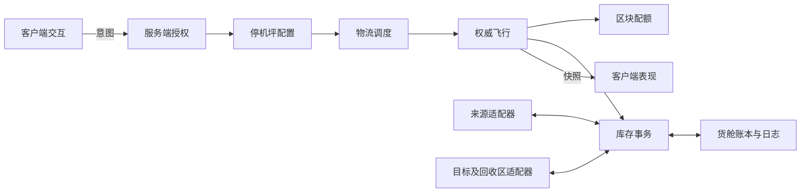

# 搬运无人机开发设计规格

文档版本：1.2　日期：2026-09-22　状态：已获准按文档开发；实现与验证进度见 `CargoDroneImplementation.md`，尚未发布。

本文件是开发依据，优先于 `CargoDroneDesign.md` 概念方案。目标读者：玩法、C#运行时、XUi、模型资源、联机和测试开发者。模块、消息和文件名均为拟定设计，不表示现有代码已提供这些接口。

## 0. 决策状态与阅读方式

| 状态 | 含义 |
| --- | --- |
| 用户明确需求 | 收取自动采矿机和林场产物，送到指定箱子；64格用于停机坪采集范围，配送应更远；设计交付后已要求按文档开发 |
| 本版设计决策 | 为消除开发歧义而选定的行为，是后续实现规格；不代表用户逐项确认过 |
| 调试默认值 | 1000格配送、6包载量、速度、电量和性能配额等，可在实验后调整并记录 |
| 技术门槛G | 需要实际游戏接口验证的能力；未通过前不能宣称对应功能可交付 |

先读1～5节理解范围，按18节验证接口，再按19节实施；7～15节为实现合同，20节为验收依据。技术门槛失败需形成替代设计，不得自行把远程配送缩成近距离瞬移。

用户最新确认（2026-09-22）：小范围熟人游玩，取消来源和仓库的所有者限制，不判断组队。类型、距离、实例替换识别和库存保护继续保留。旧矿机、林场和箱子缺少记录时，首次绑定只生成持久实例编号，不认领原生所有权，因此不再要求为身份登记而拾起重放。此规则取代之前的同主人及旧设备重放要求。

## 1. 产品目标与范围

### 1.1 玩家体验

在矿区或林场放置物流停机坪，将周围64格内设备加入取货列表，并指定远处基地收货箱。一架可见工业无人机搬运设备已经生产出的资源包。

典型场景：取货点距停机坪40格，基地箱子距停机坪800格。取货、送基地、返航充电全过程无需玩家陪飞；目标不受64格采集圈限制。

| 需求ID | 必须实现 |
| --- | --- |
| R01 | 七种指定采矿机及自动林场，只收已完成产物 |
| R02 | 采集半径、配送距离独立配置、校验和显示 |
| R03 | 明确绑定来源及唯一目标；目标无效不改投 |
| R04 | 可见飞行，服务端确认到达后装卸 |
| R05 | 完整物品数据和数量守恒，覆盖并发与崩溃恢复 |
| R06 | 按需加载远程航路，无需玩家沿途跟随 |
| R07 | 服务端授权和结算，拒绝客户端货物／到达结算 |
| R08 | 配置、启停、召回、异常原因与滞留货物回收 |
| R09 | 不改变已有配方、燃料、配件、包内容与生产周期 |
| R10 | 限制全服区块、路径计算和调度开销 |

### 1.2 首版边界

- 一坪一机，最多8来源、1目标；每趟取一台来源，不途中多点拼单。
- 固定“采矿机／林场→储物箱”。不补油、不拆包、不向加工设备投料。
- 支持室外与开放式厂区；不承诺自动开门、地下隧道和复杂室内寻路。
- 所有者离线停止运输，不计算服务器关闭期间的航程或补发产物。
- 无战斗、击落、维修、载人、治疗与随身跟随；不占原随身无人机部署额度。
- 不支持商人、车辆、背包、世界战利品及未适配第三方容器作目标。
- 注册端点需要可靠持久身份；不任意追加旧机器原生序列化字节。

## 2. 现有环境与接入依据

以下来自工作区文本检查，未做程序集探测或真实游戏测试。路径相对于Mods目录。

| 依据 | 已核对事实 | 影响 |
| --- | --- | --- |
| `99-AEC_T16_RuntimeFix/Source/CollectorBatchStorage.cs` | `TileEntityCollector.Items`、`GetSlotOutputType`；矿机／林场3×2格；常规每格3包，打包器6包 | 6包载量不是6叠 |
| 同文件 `Applies` | 还包含鸡舍 | 物流独立白名单 |
| `98-AECxProjectZ_Tweaks/Config/items.xml` | `yfForestryWoodBundle`拆出12000木头 | 直接搬包，不触发拆包 |
| `97-AutomationWorkshop/Source/InventoryTransfer.cs` | 克隆ItemStack、完整ItemValue比较、锁格、先合堆再空格 | 提炼规则，不能直接套用批量 |
| `Source/TransferRules.cs` | 批量16，同区块用坐标右移4位判断 | 无人机独立6包预算，不改旧常量 |
| `Source/Logistics.cs` | 服务端调度、忙碌检查、4格供电、`Chunk.write`互斥、同区块限制 | 内存锁不等于磁盘原子性 |
| `Source/Conveyors.cs` | 快照后回写，检查所有者及格锁 | 新恢复栅栏须覆盖旧传送带写入 |
| `Source/MachineSettings.cs` | 世界内XML、原子替换备份、版本及8格管理校验 | 参考管理流程，不把配置XML当货舱账本 |
| `Source/MachineConfigurationUI.cs` | 原生激活菜单、请求回复、字符串上限、真实Sender、对象池 | 独立物流协议并延续校验模式 |
| `tools/EscortNPC/AutomationGameQA.cs`等 | 调用 `GameManager.Instance.AddChunkObserver(...)` | 有加载候选入口；移动、释放、最小半径和负载未证实 |
| 游戏 `Data/Config/entityclasses.xml` | `entityJunkDrone`使用`EntityDrone` | 可研究视觉资源，不假设能复用物流AI |
| `97-AutomationWorkshop/ModInfo.xml`、`PLAN.md` | 安装声明0.9.0，源码及待装版本另有进展 | 开发先确定基线，禁止混装 |

来源白名单：`AutoMinerIron`、`AutoMinerLead`、`AutoMinerCoal`、`AutoMinerNitrate`、`AutoMinerClay`、`AutoMinerShale`、`AutoMinerBrass`、`yfAutoForestry`。

首批目标为可提供可靠身份、库存、访问锁和所有权的玩家储物箱及`yfAutoOutput`。原生类型和方块清单由G01探测产出；不能宣称任意箱子兼容。

## 3. 计量与参数

### 3.1 三种距离

- 采集半径：停机坪锚点到来源主方块中心的三维直线距离≤64格，含边界。
- 配送距离：停机坪锚点到目标主方块中心的三维直线距离≤1000格，含边界；不是整条路线长度。
- 实际航程：停机坪→取货点→卸货点→停机坪的路径总长，包含升降和绕障。
- 装卸点：模型外可达悬停位置，不能直接飞向方块中心。
- 1包：产出ItemStack的count为1，一格原库存可以有多包。

主／子方块都解析到主方块。2×2停机坪锚点使用主方块中心，视觉起降点单独偏移；预览圈与服务器计算一致。

时间采用服务器单调模拟时钟的真实秒。暂停、离线冻结、等待I/O和区块时相关计时不推进。存档保存剩余时长，不存进程内绝对时间戳。

### 3.2 调试默认值

| 参数 | 默认 | 约束 |
| --- | --- | --- |
| CollectionRadius | 64格 | 仅服务端管理员配置 |
| DeliveryRadius | 1000格 | 独立于采集；仍受世界边界、路线及续航限制 |
| SourceLimit | 8 | 去重后的来源数 |
| CargoLimit | 6包 | 6逻辑格，每格1包 |
| CruiseSpeed / ApproachSpeed | 6 / 2格每秒 | 最后3格减速；服务端积分 |
| HandlingDuration | 2秒/处 | 结束时重验后提交 |
| DispatchInterval | 2秒 | 逻辑调度，不扫描世界球体 |
| BatteryCapacity | 600飞行秒 | 每飞行秒1000整数能量单位 |
| ReserveFraction | 满电30% | 起飞任务估算≤420飞行秒 |
| FullChargeDuration | 60秒 | 停靠通电时线性充电 |
| BusyWait | 5秒 | 容器访问锁等待上限 |
| WaitRetry | 2、5、15、30秒 | 退避最高30秒，事件可提前唤醒 |
| FullLoadWait | 默认关闭，可选30秒 | 单来源满载提前起飞，超时有货就送 |
| MaxAirborneGlobal | 4 | 超额按停机坪等待时间排队 |
| MaxHubPerOwner / MaxHubGlobal | 4 / 16 | 含暂停设备 |
| MaxChunkLeasePerFlight | 24区块 | 原生observer实际覆盖计入 |
| MaxExtraLoadedChunks | 128区块 | 物流额外保持并集，含停机坪监控 |
| MaxRouteWorkPerTick | 2毫秒目标 | 超预算切片，不输出未经验证的路径 |
| FlightSnapshotRate | 2Hz | 关键阶段即时可靠推送，位置可经测试调到5Hz |

所有值必须有限且合法。消息／存档边界随来源或载量上限同步调整。管理员调小范围不截断货物：活动航班用创建时规则版本，后续用新值；旧绑定超界标记需调整。

### 3.3 能量规则

800格目标、40格来源，直线任务约1600～1680格，巡航267～280秒；1000格目标约2000～2128格，巡航333～355秒。另计装卸、升降和绕障，不能保证所有地形均可达。

飞行、接近、主动悬停每秒消耗1飞行秒能量；充电每秒增加10飞行秒。等待区块等逻辑冻结不耗能，持续绕障不能归类为免费等待。

起飞前做保守返航估算，途中每次新规划校验剩余电量是否覆盖返航和预留。超出预算立即停止深入并返航；新障碍令返航也不可达时安全冻结，不透支或瞬移。

## 4. 玩家交互与界面

### 4.1 建造

方块ID拟定`yfCargoDroneHub`，名称“物流无人机停机坪”，放置即含一架物流无人机。初始暂停、无绑定、电量0。建议配方：自动化设备制造工作台，`yfAutoFrame`×4、`yfAutoMotor`×4、`yfAutoController`×2，120秒；不消耗随身无人机。数值可调。

占地2×2，上方至少2格净空，最终碰撞尺寸由G05验证。供电沿用4格供电接口，不声明未接入真实电网的额外瓦数。

### 4.2 来源绑定

在停机坪8格内打开配置并选择添加来源。服务器创建绑定会话，包含玩家、HubId、随机令牌和120秒剩余时限。玩家到来源8格内长按“加入取货列表”；服务器同时核验距坪64格、身份、所有权和白名单。

超时、取消、死亡、离线清除临时会话。重复来源不新增；多人保存使用ExpectedRevision，冲突要求刷新，不能最后写入覆盖。

### 4.3 远端收货点

玩家在基地箱子8格内选择“登记物流收货点”，命名后由服务器登记持久EndpointId；无需一直保持停机坪绑定模式。每人最多64条登记，名称≤24字符且UTF-8≤96字节。

停机坪可选择已登记点，列表显示名称、坐标、配送距离和上次核验时间；未加载显示“等待验证”。保存时按需核验，失败保留草稿并说明原因；原位新箱必须重新登记。

注销登记只撤销物流资格，不删除箱子；被活动航班引用时停止后续交付并返航。登记不提供远程手动开箱能力。

### 4.4 面板

| 区域 | 内容 | 操作 |
| --- | --- | --- |
| 左栏 | 来源名称、坐标、采集距离、已知产物、优先级、最后服务时间 | 添加、移除、0～2优先级 |
| 中央 | 目标、配送距离、预计往返、航班状态和具体原因 | 选目标、保存、启停、召回 |
| 右栏 | 电量、6格只读飞行货舱、累计送达 | 停靠后“转入回收格” |
| 下部 | 原生背包、独立6格回收区 | 原生编辑锁；货舱不可拖放 |

缓存数据必须标明时间，不冒充实时库存。以现有Project Z背包布局为约束，验收1920×1080及用户实际UI缩放，具体XUi像素布局经截图检查后冻结。

| 命令 | 精确行为 |
| --- | --- |
| 保存 | 无航班且Cargo空则应用，否则保存PendingConfig |
| 启动 | 启用派单；滞留货物优先按旧目标重送，不新取货 |
| 暂停派单 | 停止新取货，当前短事务完成后安全返航，保留Cargo；停靠仍可充电 |
| 召回 | 关闭派单并申请返航，不跳过路径 |
| 转入回收格 | 已停靠、无事务且回收区未打开时事务转移，随后玩家原生开箱取走 |
| 应用待定配置 | 无航班且Cargo空；回收区有货时可应用，但清空前不派单 |
| 拾取停机坪 | 停靠、暂停、Cargo及回收区空、无未完成事务／回收记录 |

回收区是真实原生库存，Cargo是服务器账本库存；必须转移后才切换归属，不同时暴露两个可编辑副本。回收区仅用于取回货物，不允许玩家存入、不开放传送带端口，不充当额外货舱；UI与服务器同时限制。

## 5. 调度与物流规则

### 5.1 派单条件

停机坪有效、所有者在线、用户启用、供电、电量足够、Cargo与回收区空、无恢复事务、有合法来源、目标预检能装至少1包、航班及区块配额可用，全部成立才派单。

以上是“新取货航班”的条件。“旧货重送航班”要求Cargo非空且CargoManifest有效，不要求有货来源或来源仍存在，目标取自CargoManifest；其余权限、供电、电量、配额及回收区为空的条件不变。重送优先，不重复申请来源软预留。

目标未知先核验，不把未知视为空箱。缓存只辅助排序，创建航班要取得本次预检结果；预检不锁玩家箱格，到达还要重验。

### 5.2 来源公平性

只看最多8个绑定端点。无货、忙碌、权限无效、恢复锁定不入候选。候选顺序：等待超过300有效秒的可服务端点优先，按等待长短；其余按用户优先级2→0、占用率降序、上次成功服务时间升序；最后按EndpointId稳定排序。

等待时长只在有货且可服务时累计。占用率按实际容量计算，拆下打包器造成超容量库存不能被删除。全服按停机坪等待时长分配航班槽，避免一坪占满名额。

### 5.3 软预留与装货

为来源建立FlightId软预留，租期预计到达时间加30秒、最多180秒，必要时服务端续期。只阻止本物流重复派单，不锁生产或玩家取货；取消、失效、超时均释放。

到达重算最多6包，按槽号取原生OutputType允许的产物，完整保留物品数据。异常物品留原处并提示。目标预检仅能放3包时可装3包，实际目标容量变化由卸货处理。

默认有1包也派送。可选满载优先只等单一来源6包，最多30秒，不跨来源拼单。

### 5.4 卸货与重送

先完整ItemValue匹配合堆，再填未锁空格，使用真实堆叠上限。一次计划可涉及多槽，但只提交一次。无需首格样品，不预留首格。

部分卸货后余货返航；停靠每30秒或容量变化事件重验，电量足够则创建“仅送旧货”新航班，不新采集。回收清空Cargo后才可应用新目标。

装卸点被玩家打开时最多等5秒；取货端超时空载返航，目标端超时带货返航。

## 6. 模块架构

| 模块 | 输入输出责任 | 禁止事项 |
| --- | --- | --- |
| HubService | 生命周期、配置、供电、回收区 | 直接改来源物品 |
| EndpointRegistry | 身份、位置、类型、所有者、代次 | 坐标相同即认定同实例 |
| CollectorSourceAdapter | 输出槽快照、锁、提交能力 | 生产、拆包、补油 |
| StorageTargetAdapter | 容量、格锁、访问锁、堆叠计划 | 未知容器猜测写入 |
| Scheduler | 候选、公平性、预检、软预留 | 提交库存 |
| FlightService | 位置、航路、能耗、到达、状态转换 | 未加载地形当空气 |
| ChunkLeaseService | 申请、就绪、释放、预算 | 无限常驻整条航线 |
| TransferService | 准备、提交、恢复、逻辑栅栏 | 以动画结束作为交付凭据 |
| PersistenceService | 日志、快照、迁移、校验 | 旧快照覆盖未知新库存 |
| NetworkService | 认证、去重、限流、兴趣范围 | 信任客户端物品数量 |
| Presentation | 模型、插值、声光 | 第二份权威货物 |

世界对象访问和库存提交在游戏要求的主线程。后台只处理不可变快照编码、文件I/O及明确线程安全的纯计算，不持有TileEntity作异步写入。

## 7. 数据模型与不变量

### 7.1 持久化模型

| 记录 | 关键字段 | 约束 |
| --- | --- | --- |
| WorldHeader | SchemaVersion、WorldId、SaveEpoch、RulesVersion | 标识具体存档实例，不只地图名 |
| HubRecord | HubId、主坐标、OwnerId、Incarnation、Active/PendingConfig、ConfigRevision、Enabled、DroneId | 新放置新身份 |
| HubConfig | 来源ID与优先级、TargetId、DispatchMode | 来源≤8，目标唯一或未设置 |
| EndpointRecord | EndpointId、类型、坐标、BlockName、OwnerId、Incarnation、能力、LastVerified | 身份须与原生保存一致 |
| DroneRecord | DroneId、HubId、BatteryUnits、CargoRevision、6格Cargo、CargoManifest、统计 | 完整物品编码，禁止只存ID/count |
| CargoManifest | 首次取货FlightId、原SourceId、固定TargetId、配置版本 | Cargo非空必须存在，重送沿用目标；清空后才结束 |
| FlightRecord | FlightId、配置快照、RulesVersion、SourceId可空、TargetId、Phase、HoldReason、ResumePhase、位置、路径版本、剩余计时 | 每架最多一个活动航班 |
| RouteRecord | 航点段、已验证范围、碰撞尺寸、路径版本、返航估算、安全位置 | 重启缓存要重验 |
| EndpointCommitMarker | EndpointId、SaveEpoch、InventoryRevision、LastTxId | 与原生库存同一恢复边界，见G03 |
| TransferTx | TxId、FlightId、操作、端点、预期版本、槽前后图、Cargo前后图、校验、阶段 | 有界日志，见10节 |
| RecoveryRecord | RecoveryId、原Hub、货物、原位置、回收容器身份、阶段 | 与Cargo不能同时拥有货物 |

EndpointLease与ChunkLease为运行时租约，保存必要意图但不持久化原生句柄，重启重新申请。UUID固定16字节，坐标有符号32位并检查世界边界；版本用非负64位且拒绝回绕。网络实体ID不能用于持久身份。

物品快照深拷贝；未知类型或解码失败冻结，不能转换为空气。路径、配置、货物都有独立版本，不能用一份更新时间代替所有并发检查。

### 7.2 必须成立的不变量

| ID | 不变量 |
| --- | --- |
| I01 | 一坪一架权威无人机，每架最多一个活动航班 |
| I02 | 每件货物只属于来源、Cargo、目标、回收区或RecoveryRecord之一 |
| I03 | 同TxId重试和恢复不重复增减 |
| I04 | 装卸开始及提交前均验证到达、身份、权限、版本和锁 |
| I05 | Cargo≤6包，每格0或1；调小上限也不截断旧货 |
| I06 | 未就绪区块及无效端点不能写入 |
| I07 | 航班目标固定；权限撤销仍阻止后续交付 |
| I08 | 燃料、配件、生产计时不在物流写集 |
| I09 | 客户端重建、迟到和重发不能创建货物 |
| I10 | 恢复库存先于恢复位置；位置回滚不触发重复装货 |

守恒按完整物品指纹核对来源、Cargo、目标、回收区、回收记录及合法移交玩家／掉落的总数，另计原生生产、消费、销毁；不能在生产运行中只比较两箱总数。

## 8. 状态机与事件

Hub模式为Disabled、Ready、Blocked、Recovering、Destroyed。充电独立，暂停仍可充电。Flight阶段与HoldReason分离。

| 阶段 | 进入动作 | 正常出口 |
| --- | --- | --- |
| None | 停靠无航班 | 预检后Preflight |
| Preflight | 固定配置、软预留、区块、能量校验 | ToSource；旧货重送则ToTarget |
| ToSource | 已验证路径飞行 | 距悬停点≤1格、速度≤0.5格/秒后Loading |
| Loading | 稳定2秒，重验，执行一次装货事务 | 有货ToTarget，无货Returning |
| ToTarget | 固定目标飞行 | 同到达条件后Unloading |
| Unloading | 稳定2秒，一次全量或部分卸货事务 | Returning |
| Returning | 不新取货，按合法路径返航 | 到坪落地后Docking |
| Docking | 保存位置、电量、Cargo和结果，释放租约 | None，余货标记滞留 |
| RecoveryOnly | 坪毁或权威数据异常，停普通调度 | 专门回收结束 |

HoldReason包括ChunkBudget、ChunkLoading、ContainerBusy、OwnerOffline、PathBlocked、PersistencePending、RecoveryRequired。冻结时记录ResumePhase、剩余时间和安全位置；路径阻挡消失后仍需重算。

事件优先级：世界关闭／恢复错误→销毁与权限撤销→已准备事务的完成／恢复→暂停召回／离线→区块路径电量→飞行→新派单。事务进入持久提交阶段后普通召回不能打断，先确定货物归属再返航。

停机坪断电视为停止新取货和返航事件；已提交货物留Cargo，不继续向远端深入。无人机已在卸货事务P1之后则先完成／恢复该事务，再返航。

取货前来源消失为空载返航；取货后消失继续送原目标；目标消失或换主带货返航。配额不足冻结当前阶段；存档无法判定进入RecoveryOnly。取消不能删除带货记录。

单人暂停冻结全部，多人所有者离线仅冻结其航班。上线重新验证后恢复同FlightId，不重置已完成装卸阶段。

所有者离线或单人暂停期间，停靠充电和调度等待时长也冻结；“暂停派单仍可充电”只适用于世界运行且所有者在线的手动暂停。

## 9. 库存适配和计划

### 9.1 适配器能力

解析主方块／持久实例身份、支持类型、原生访问锁／格锁、完整快照、库存版本、写集、变更通知、恢复栅栏、耐久提交。具体API除第2节已发现入口外均待验证；能反射读数组不代表可安全写。

下列是待实现的逻辑操作合同，不是对原生API签名的声明：

| 操作 | 输入 | 返回与副作用 |
| --- | --- | --- |
| ResolveEndpoint | WorldId、EndpointId、预期Incarnation | 当前引用或Missing／Replaced／NotLoaded；不隐式生成箱子 |
| ReadSnapshot | 已验证端点、操作身份 | 不可变槽快照、版本、格锁、权限和时间；无库存变化 |
| PlanLoad / PlanUnload | 端点快照、Cargo快照、包数预算 | 前后写集、可转数量或0；纯计算，不保存世界引用 |
| TryBeginTransfer | FlightId、到达凭据、预期版本、计划 | Accepted＋TxId、Retryable或Rejected；Accepted仍不代表已提交 |
| PollTransfer | TxId | Preparing／Saving／Committed／Aborted／RecoveryRequired；Committed才可推进飞行 |
| RequestChunkLease | WorldId、用途、空间需求、预算持有者 | LeaseId及Queued／Loading／Ready；不得同步阻塞主线程 |
| ReleaseLease | LeaseId | 幂等释放；不存在的旧句柄只记诊断，不误减别的引用 |

TryBeginTransfer收到重复事务意图必须定位原TxId，不能再次生成扣货事务。所有返回错误映射到第13节玩家状态码，内部详细原因保留在服务器诊断中。

### 9.2 装货顺序

1. 服务端确认到达，取得来源、Cargo和Flight快照。
2. 获取端点短期逻辑栅栏，重验访问锁、生命周期、权限和版本。
3. 按允许输出槽计划最多6个单包，减少原槽数量，耗尽才置空。
4. 生成唯一TxId及两端前后图，执行第10节协议。
5. 提交后通知网络／存档，推进已装货阶段，释放软预留。
6. 调用G01验证的取货通知，使生产续填正常；不擅自清空`fillDataLookup`或重置计时。

### 9.3 卸货顺序

到达与目标身份→逻辑栅栏→当前容量与格锁→合堆／空格计划→确定Cargo可卸子集→事务提交→发布库存和Cargo→余货返航。0可卸不记成功、不增加送达计数。

Cargo→回收区同样走事务，随后玩家原生开箱取走；不另写绕过保证的“直接给玩家”路径。

### 9.4 并发

按稳定世界／EndpointId顺序获取锁。短互斥只用于检查和内存提交；磁盘等待用可跨帧逻辑栅栏，不能持Monitor等I/O卡住游戏。

栅栏期间，原生生产、玩家开箱拖放、传送带和受支持自动化对该端点写入必须等待。未覆盖的写入路径即G03失败。数分钟飞行期间不锁箱。

玩家已持访问锁时不抢锁。库存版本变化使计划失效就重算，不能回写旧全量数组。破坏、卸载和保存也须遵循事务栅栏。

## 10. 持久化、事务提交与崩溃恢复

### 10.1 设计选择

物理装货和卸货是两个独立事务，中间货物归服务器Cargo账本。一次普通转移只涉及一个原生库存端点及账本，不同时跨源区块和目标区块搬货。这减小了提交边界，但原生区块文件与账本文件仍不能靠内存锁自动原子保存。

正式方案选择“预写日志＋原生端点提交标记＋逻辑恢复栅栏”。这是G03待证明的协议设计，不是声称已找到可用原生耐久保存接口。无法证明端点标记和物品库存同一保存边界，就不能实现下面的自动恢复保证。

### 10.2 拟定存储

在当前世界存档目录下使用独立子目录 `cargo-drones/`：

| 文件 | 内容 | 写入方式 |
| --- | --- | --- |
| manifest | 格式版本、WorldId、SaveEpoch、当前完整检查点编号 | 临时文件→校验→耐久刷新→原子替换，保留上一版 |
| config.snapshot | 停机坪、绑定、收货点注册和配置版本 | 带校验的完整快照，不含第二份Cargo权威副本 |
| ledger.snapshot | Drone、Cargo、Flight、Recovery、统计及最后日志序号 | 检查点快照 |
| transactions.wal | 有界、带长度、序号和校验的事务记录 | 追加并耐久刷新；尾部半条可识别，中部损坏不可跳过 |
| diagnostics.log | 结构化诊断和性能汇总 | 非权威日志，可轮转 |

格式采用版本化二进制账本／日志，配置可使用现有风格的版本化XML；具体编码在G03完成后冻结。ItemStack使用与目标游戏版本相符的序列化，不能自行丢弃模组、耐久、品质或其它原生字段。

不得往原生TileEntity未经长度界定的字节流尾部任意追加数据。候选方案必须证明标记随库存同版本保存、旧存档可读、未知版本明确拒绝；单独写一个“坐标→版本”XML不满足此条件。

### 10.3 提交流程

| 步骤 | 行为 | 发生崩溃后的依据 |
| --- | --- | --- |
| P0 | 获取逻辑栅栏，读取当前端点版本和Cargo版本，验证计划 | 尚未写PREPARE，不允许任何货物变化 |
| P1 | 追加PREPARE：TxId、前后图、身份、前后版本、Flight阶段；耐久刷新 | PREPARE存在才允许实际修改 |
| P2 | 主线程同时应用端点后图／提交标记与Cargo后图到受保护内存 | 栅栏阻止生产、玩家和其它自动化观察可消费的半提交状态 |
| P3 | 通过验证过的保存机制，使原生端点后图和标记耐久落盘，获得明确完成结果 | 未完成时保持栅栏，不以SetModified当完成 |
| P4 | 追加COMMIT及Cargo后图、Flight下一阶段、统计增量，耐久刷新 | COMMIT代表正式货物归属及航班推进 |
| P5 | 释放栅栏，发布网络与原生变更通知，更新回复 | 重发只能返回已提交结果 |

在P3等待期间不能阻塞主线程；通过跨帧状态机等待持久化完成。存储超时进入PersistencePending并停止该端点，不因超时就随意回滚已经可能落盘的变化。

P3返回“失败但不知道是否写入”时按恢复协议判断，不继续P4。P4失败则栅栏不释放；保留PREPARE和端点提交标记，恢复后补齐账本提交。文件系统错误不得用无限刷日志重试扩大磁盘故障。

P2～P5期间，物流查询界面只显示最后已提交快照和“保存中”；原生访问与网络写入不得绕过栅栏消费暂定后图。已登记端点的原生生产、玩家和传送带修改都须推进InventoryRevision，保留可验证的LastTxId；否则无法判定“本Tx之后的合法新库存”。卸载再加载不能重置这些值。

### 10.4 恢复矩阵

启动先建立世界身份和恢复栅栏，在受影响端点允许原生生产／开箱之前完成恢复。加载端点用于检查，不能在检查前让它被生产更新。端点实例必须相同。

| WAL状态 | 原生端点持久状态 | 恢复动作 |
| --- | --- | --- |
| 无完整PREPARE | 任意 | 不应发生过修改；若发现孤立提交标记则冻结调查 |
| PREPARE无COMMIT | 正好是预期前版本，内容与前图一致 | 回到前图账本状态，写ABORT；允许稍后以新事务重试 |
| PREPARE无COMMIT | 正好是本Tx后版本及标记，内容与后图一致 | 采用Cargo后图，补COMMIT及Flight阶段，执行一次 |
| PREPARE无COMMIT | 更高版本、不同实例、内容冲突或无法读取 | RecoveryRequired；不覆盖、不补发 |
| 完整COMMIT | 本Tx或后续已验证版本，世界检查点连续 | 重放账本至对应日志序号；不再次修改已提交端点 |
| 完整COMMIT | 端点落在本Tx前版本 | 违反耐久假设或发生不完整存档回滚；冻结，不自动“重送” |

不靠当前数量判断事务是否执行，因为原生生产和玩家消费可能产生相同数量。协议依赖端点事务标记、版本和有效检查点链。若G03不能支持这些证据，矩阵不成立，必须改设计。

### 10.5 检查点、备份和迁移

检查点只在所包含事务都已到P4、原生库存耐久结果已确认时建立。先写新账本快照并验证，再发布manifest，最后才轮换不再需要的WAL前缀；保留至少一个完整可恢复检查点。不按“超过多少MB”直接删除未决日志。

完整备份必须包含同一SaveEpoch的原生世界、物流目录及登记端点标记。只恢复世界文件或只恢复物流文件均可能造成复制；识别到不一致时冻结物流并指出需要匹配备份。未知新版本只读报错，不以默认空配置继续运行。

格式升级步骤：完整备份→读取旧版本→内存迁移→校验身份与守恒→新格式写入→重新读取→发布新manifest。老格式不原地覆盖。卸载／回滚模组前必须清空Cargo和回收记录，或明确保留可迁移账本；不能仅换旧DLL忽略新库存。

## 11. 航路、区块加载和生命周期

### 11.1 真实飞行的责任

服务器保存权威位置和航点，客户端只是插值模型；远处无人观察时服务器继续按相同速度推进，不让货物提前到达。模型对象不持有库存，也不要求存在原生EntityDrone才能推进。

每个来源类型提供装货悬停候选偏移，目标箱和停机坪也有专用偏移。候选要避开方块实体、林场的大模型和邻近障碍；可视模型没有碰撞体时需适配保守禁入体积，不能仅检查方块中心射线。

建议无人机净空包围体约宽1.2格、高0.8格，加0.2格安全余量；最终以资源包围盒冻结。采用扫掠碰撞检测整段机体，不只在航点检测。

### 11.2 分段规划算法合同

1. 起点先验证升空净空，默认巡航高度为已知局部障碍顶面上方6格，并受世界高度边界限制。
2. 长路线按不超过32格的段推进，预取前方航段所需区块；规划只读取已就绪碰撞数据。
3. 尝试直线段，遇障碍进行有限抬高（最多较候选巡航高度增加24格）及局部绕行；局部搜索节点预算暂定256。
4. 对每段记录有效性、航程增量、最近安全悬停点及已知返航走廊。首次估计是保守估计，不能把未勘测的整条线宣称为已验证路径。
5. 前方未就绪则在安全点冻结；局部搜索失败或触顶返回明确PathBlocked，不穿越也不无限搜索。
6. 新障碍或路径版本变化时切片重规划。重规划使能量不足则回走已验证路线，回走仍要检测新的障碍。

允许首次航班因未勘测地形中途返航，但必须保留货物并给出原因。路径不可达与距离超限、续航不足分开提示。返回基地箱子在屋内时必须有可达卸货窗口或移至开放位置，不能隔墙卸货。

### 11.3 受限区块加载

不要求整条1000格航线同时加载。每架请求当前安全段、小范围前方预取、当前装卸点，以及停机坪生命周期和供电监控必需的区块。所有请求由全服ChunkLeaseService合并，引用计数按实际区块并集统计。

原生observer可能加载比请求更多的区块，必须以实际覆盖核算配额；最小原生观察范围已超过24区块时记录G02结果并调整默认值，不私自绕过预算。玩家已加载区块可复用，但若物流建立保持引用，仍记录该引用，玩家离开时重新计入额外负载。

租约流程为Queued→Loading→Ready→Releasing→Released，失败可进入TimedOut。Ready必须表示原生库存、碰撞和生命周期所需对象均可访问，不只“磁盘读完”。LeaseId与DroneId关联，世界切换、断线冻结、销毁、错误退出统一清理。

区块配额遵循公平排队，至少为正在航行的当前安全位置保留预算。取货点完成耐久提交后可释放；目标卸货后可释放；后方路径可释放，仅保留路径描述，不强留整条返航走廊。

### 11.4 防止加载死锁

派出前预留当前安全段及必要端点的最低预算。扩展前方失败不能先释放脚下区块；先停止推进，保留安全点，排队申请。全服按航班创建时间分配新增预算，禁止每架占满上限后彼此等待。

30秒未获前方加载预算显示“等待服务器区块额度”，不误报路线损坏。持续等待可安全召回；召回也需要预算。强制卸载或内存压力事件触发持久冻结，然后释放句柄，恢复时重新建立，不能留下悬空TileEntity引用。

### 11.5 停机坪、供电和原生更新

运行中的停机坪需要生命周期监控；可保持坪及供电检测所需最小区块，也可用G02证明可靠的等价事件机制。不能因为离坪远就不再检测坪被毁或断电。

原生供电网络可能要求更远电源区块加载，必须在G02记录实际依赖和额外预算。若只加载接口不足以判定真实电力，不能把旧缓存“有电”当永久通电。

加载远端来源可能触发原生生产更新；保持现有生产规则，不自行计算离线收益、不反复加载触发重复产物。统计和测试分别记录生产新增与搬运量。

## 12. 联机协议与权限

### 12.1 统一消息约束

所有C→S消息带ProtocolVersion、WorldSessionId、RequestId和消息类型；配置写入再带HubId、SessionToken、ExpectedRevision。玩家身份取真实网络Sender，不从客户端OwnerId决定授权。

ID固定长度，来源列表≤8，货舱≤6；名称≤96 UTF-8字节，其它字符串按类型上限验证。拒绝未知枚举、负版本、越界坐标、NaN／无穷位置及超长数组；在分配内存前检查长度。暂定单消息≤16KiB，完整物品序列化若超过该值必须有界分片或报错，不截断物品数据。

调试编码上限：单个完整物品记录64KiB、一次Cargo快照384KiB、单条事务日志4MiB。分片单组最多32片、每玩家最多2个未完成组、10秒过期；组ID、总长、校验和版本必须一致。超过上限的模组物品保留原处并报告不支持，不省略字段凑长度。具体上限由G01/G06用真实序列化结果验证后冻结。

每玩家配置写请求最多2次/秒、短突发4次；面板只读请求最多2次/秒。拒绝消息带错误码和当前版本，不把整个堆栈回给客户端。池化包每次重新设置全部字段，包括失败回复，避免泄露上一玩家快照。

### 12.2 消息合同

| 拟定消息 | 方向 | 必要内容 | 服务器条件／结果 |
| --- | --- | --- | --- |
| RegisterEndpoint | C→S | 当前交互坐标、显示名 | 玩家距端点≤8格、真实权限；返回EndpointId与代次 |
| UnregisterEndpoint | C→S | EndpointId、预期注册版本 | 本人登记；撤销新航班并处理活动引用 |
| BeginSourceBinding | C→S | HubId | 玩家距坪≤8格且管理授权；创建120秒令牌 |
| BindSource | C→S | 令牌、来源坐标、ExpectedRevision | 玩家距来源≤8格、来源距坪≤64格、支持的采集类型；返回新配置版本 |
| ListTargets | C→S | HubId、页码 | 管理会话有效，仅返回有权登记；每页最多16条 |
| SaveHubConfig | C→S | 来源ID、目标ID、模式、ExpectedRevision | 当前距坪≤8格，验证两个范围及权限；返回Active或Pending |
| HubCommand | C→S | 启动／暂停／召回／回收 | 当前距坪≤8格，生命周期和命令前置条件满足 |
| HubSnapshot | S→C | 权威配置、状态、原因、缓存年龄、Cargo摘要、电量 | 仅授权面板订阅者，客户端不回传作为结算 |
| FlightSnapshot | S→C | DroneId、FlightId、Sequence、阶段、位置、朝向、速度、服务端时间 | 发给能观察附近航段的客户端，不广播整服库存 |
| CargoChanged | S→C | CargoRevision、完整或有界分片快照 | 只读显示；重放丢旧版本 |
| OperationResult | S→C | RequestId、结果码、版本、可重试标记 | 可重复返回，不重复执行 |

配置、命令、阶段变化采用可靠传输；位置快照允许丢旧包。若原生网络只支持一种传输，不虚构不可靠通道，仍依靠序号丢弃过时位置。

BindSource也走与SaveHubConfig相同的版本和Active／Pending应用规则；不会因为它是快捷绑定操作就修改活动航班。读取面板可使用会话，但每次写入都重新检查当前位置和权限；来源绑定按来源附近检查，远端登记按目标附近检查。

### 12.3 请求去重

同玩家会话＋RequestId＋消息摘要相同返回已有结果；同RequestId不同内容拒绝。普通配置结果缓存至少5分钟／每玩家最多128项，过期客户端需刷新版本再发新请求。涉及Cargo操作还必须由持久TxId、CargoRevision和阶段前置条件确保缓存淘汰后仍不重复交付。

### 12.4 权限规则

来源、目标不限放置者或原生所有者，也不查询队伍、好友或盟友。停机坪配置管理仍由坪主执行。绑定前验证类型、世界和距离；缺少实例记录则生成持久 EndpointId/Incarnation，不修改原生所有权。拆除清除记录，同坐标替换生成新实例，旧任务不能误投。原生箱子忙碌、格锁、库存版本和事务栅栏继续生效；个人锁/归属不再作为自动搬运的权限边界。货舱及日志仍归属坪主，端点旧 Owner 字段只作历史元数据，不用于设备访问授权。

每次绑定、派单和提交都复核类型、实例、距离及库存操作条件；来源或目标更换原生所有者不阻止搬运。停机坪管理请求仍验证真实发送者和坪主身份，货舱归属不会随端点放置者改变。

### 12.5 同步与重连

迟到客户端先收完整Flight快照和最新Sequence，再创建一个视觉对象；对象键为WorldSessionId＋DroneId，阶段用FlightId隔离旧航班。插值延迟建议0.2秒，外推最多0.5秒，超时停在最后权威位置。

客户端模型销毁、离开观察范围或掉帧不影响服务器任务。重连不能调用“生成新无人机”；服务端世界重启更换SessionId，使旧消息全部无效。

### 12.6 仓库名称与类型筛选

用户追加要求：仓库选择以箱子名称或箱子自身牌子文字为主要搜索项，并增加类型筛选。无文字壁橱使用默认本地化名称，坐标和距离用于区分同名容器；不得因缺少牌子而排除支持的壁橱。旁边独立告示牌不自动推断为箱子名称。

名称关键字和类型同时生效，空关键字表示只按类型查找。类型为全部、普通储物箱、自动化输入箱、自动化输出箱、壁橱/柜子、其他容器；分类仍须满足原生玩家储物接口。默认按距离排序，每页 8 条。点击结果直接设为收货目标，无需填写坐标。不加入所有者或组队筛选。

当前实现搜索已加载区域内距停机坪 1000 格的可用类型，最多返回 256 个匹配项，超限提示缩小筛选。列表不强制加载远区块，也不通过搜索创建设备身份；界面说明搜索范围，目标区域未加载时提示先加载该区域。请求/回复有关键字、条目数与分页上限，服务端验证坪主和交互距离，客户端忽略过期回复。

### 12.7 矿机与林场选择

用户追加要求：采集设备也必须通过列表选择，不要求输入坐标。打开停机坪默认展示已加载区域内、距停机坪三维 64 格内的七类矿机和自动林场。支持名称/资源关键词搜索、资源类型切换、分页，已绑定项优先显示，其余按距离排序。

点击未绑定项直接发送添加请求，服务端重新验证类型、范围、实例、配置版本及最多 8 来源的限制。已绑定项标记清楚，点击移除；“管理已绑定”只列出现有绑定。已拆除、未加载或替换的绑定记录仍可在列表中移除，不必靠坐标输入清理。无记录的普通矿机仅在实际绑定时登记实例，浏览列表不改设备身份。

矿机/林场列表和仓库列表共用右侧选择区，通过左侧按钮切换；仓库同样点击直接绑定。主界面删除坐标输入框，坐标仅在条目详情中用于区分同名设备。搜索请求带来源/仓库模式、来源类型、只看已绑定选项，回复带已绑定和当前可用状态；过期或模式不符的回复不覆盖当前列表。

## 13. 销毁、回收和异常表

### 13.1 停机坪被摧毁

需要区分Cargo、原生回收区和原生方块掉落，不能把三者简单合并再让原生破坏逻辑重复掉落。

1. 在方块破坏进入不可逆阶段前停止新派单，处理正在进行的短事务；实例标记变为Destroyed并持久化。
2. Cargo若非空，事务转为唯一RecoveryRecord；同事务清空Drone的货物所有权，不能先清Cargo再异步写回收记录。
3. 原生回收区由经过验证的原生破坏规则移交；若需要统一回收容器，必须抑制原生重复掉落，并把它也纳入已验证事务。
4. 回收记录在原停机坪附近有效位置生成一次带RecoveryId的原生可拾取货物容器。区块未就绪则保留记录等待；不能生成在未加载区然后认为已交付。
5. 回收容器身份和内容耐久完成后，记录转为HandedOff；此后容器被取空或原生过期消失不再次生成。生成与HandedOff之间崩溃必须能通过RecoveryId查明是否已存在。

G04必须验证原生掉落容器的持久化、拾取、过期和唯一标记。如果无法消除“已经被拿走但记录尚未确认”的窗口，不允许自动重生；冻结记录提供诊断。战斗销毁也是首版发布门槛，不能只限制手动拾取来绕过。

### 13.2 错误码与处理

| 错误码 | 玩家文字 | 自动动作／解除条件 |
| --- | --- | --- |
| SOURCE_OUT_OF_RANGE | 取货设备超出64格采集范围 | 禁用该来源，移动或重新绑定 |
| TARGET_OUT_OF_RANGE | 收货点超出配送距离 | 保留配置草稿，更换目标 |
| NO_OUTPUT | 取货点暂无产物 | 轮询其他来源，退避重试 |
| TARGET_FULL | 收货箱已满 | 无新取货；已在途则保留余货返航 |
| CONTAINER_BUSY | 有人正在使用容器 | 最多等待5秒，然后返航 |
| TARGET_REPLACED | 箱子已被替换，请重新登记 | 停止交付，不按坐标认新箱 |
| ACCESS_REVOKED | 物流权限已失效 | 停止相关操作、带货返航 |
| NO_POWER | 停机坪未通电 | 不派单不充电，在途使用已有电量返航 |
| BATTERY_LOW | 电量不足以完成往返 | 停靠充电；在途停止深入 |
| ROUTE_TOO_LONG | 绕行后的航程超出续航 | 返回或等待调整路线，不报采集超界 |
| PATH_BLOCKED | 航路或装卸净空被阻挡 | 有界重规划，失败安全冻结 |
| CHUNK_WAIT | 等待航段加载／服务器额度 | 安全冻结，排队，不访问远端库存 |
| OWNER_OFFLINE | 所有者离线，运输已暂停 | 持久冻结，上线重新验证 |
| CONFIG_CONFLICT | 配置已被其他操作修改 | 返回当前版本，用户刷新草稿 |
| PERSISTENCE_PENDING | 等待库存保存 | 保持端点栅栏，禁止重复提交 |
| RECOVERY_REQUIRED | 货物记录需恢复，任务已冻结 | 管理员按证据恢复，不自动补发 |
| PROTOCOL_MISMATCH | 客户端与服务器物流版本不匹配 | 禁用物流操作，要求同版本 |

库存、航班、箱子身份冲突日志需包含可定位ID与坐标；玩家页面给简短原因，技术堆栈写服务器日志。

## 14. 表现资源规范

外观为工业四旋翼，深灰机架、黄色警示条、下挂封闭货箱、双侧起落架。状态灯：蓝待命、绿配送、黄充电／等待、红错误。空Cargo无货箱，有货显示一个货箱模型，包数在面板显示，不能用多个真实掉落物表现载货。

资源需提供稳定命名的起降锚点、四旋翼轴、货箱挂点、灯光位置；客户端按状态驱动，不靠动画事件通知服务器扣货。启动、巡航、装卸、停靠各有短动作，动画时间不改变服务端2秒装卸判定。

建议LOD：0～40格完整表现、40～100格简化机体与低频旋翼、超过观察范围停止渲染；声源距离衰减，多个停机坪限制同时播放数量。最终可视距离跟随游戏观察范围，不能额外强制远处客户端加载地形。

专用服务器不加载材质、贴图、声音和GameObject动画。资源加载失败用简化视觉占位并日志限流，服务器物流状态保留；不能因贴图异常清空Cargo。客户端缓存统一释放，避免每次区块重载创建永久材质副本。

## 15. 性能、诊断和安全退出

### 15.1 工作预算

调度2秒一次，分批读绑定端点；飞行物理／位置更新建议10Hz、网络2Hz；视觉动画本地帧率运行。路线计算按主线程每tick 2毫秒目标切片，区块申请每秒最多2个新原生加载请求起步，实际覆盖计入并集预算。

16停机坪全部有货时最多4个活动航班，其余公平排队。达到128物流额外区块预算停止扩展，不能提高预算来掩盖泄漏。事务保存可能是吞吐瓶颈，必须测量P1～P5延迟；合并普通快照写入可以优化，但不能合并掉PREPARE／COMMIT耐久边界。

### 15.2 必备指标

活动／排队／冻结航班数、原因分布、每分钟送达包数、空跑数、平均往返时长、路径节点数与耗时、区块租约并集及实际覆盖、observer创建／释放累计、事务各阶段延迟、未决事务数、守恒失败数、每客户端带宽。

日志事件含WorldId、HubId、DroneId、FlightId、TxId或RecoveryId、前后阶段和结果码。普通轮询不每秒写日志；首次错误和状态变化立即记录，相同错误按30秒限流。不能在日志中输出完整玩家认证信息。

### 15.3 诊断操作设计

拟提供只读状态、端点映射、租约列表、事务检查、受控暂停、重新验证操作。管理员“清空错误”“重新生成货物”不作为通用修复按钮；恢复必须依据第10节证据，不能凭数量手动补齐后还保留自动重放路径。

正常退出：停止派单→完成或持久冻结短事务→保存Cargo／Flight→释放observer和事件订阅→写完成检查点。异常退出依WAL恢复。世界切换必须清理静态字典、客户端视图和所有运行时句柄。

## 16. 集成、兼容与发布约束

### 16.1 模组归属和修改边界

建议加入 `97-AutomationWorkshop` 的独立物流命名空间，配套新增停机坪方块、独立XUi窗口、本地化、资源和配方；拟用`YFAutomation.CargoDrones`命名空间。本文不要求立刻创建文件。

需要参考的既有模块是Logistics、MachineSettings、MachineConfigurationUI、InventoryTransfer及Conveyors。复用规则应抽取为明确合同，不能简单把既有`SameChunk`检查删除，也不能修改通用Batch=16来满足6包Cargo。

`99-AEC_T16_RuntimeFix`的生产算法继续负责生产；如取货通知或持久化适配需要Harmony挂接，应限定白名单和已登记端点，并注明补丁顺序。不能让物流补丁影响鸡舍、蜂箱或普通未登记容器。

新停机坪可使用独立新增原生特征，但旧设备特征序列不被整体重排。恢复栅栏是新增共享写入约束，需要逐一协调既有生产和传送带，而非新建一把旧代码不认识的锁。

### 16.2 联机版本和安装

服务端和所有客户端需要同一物流协议、资源和存档格式支持。版本不一致时拒绝物流交互和模型生成，不能客户端猜兼容。具体与整个模组登录兼容检查如何衔接由G06确定。

开发使用独立暂存输出目录，明确所基于的自动化版本、游戏程序集版本和源码修订。现有构建脚本默认会写安装目录，因此后续实现应显式指定暂存输出；本轮不调用脚本。

发布包包含匹配DLL、Config、Resources、本地化和迁移说明，记录哈希清单；不只替换DLL。先在隔离世界验收，再按授权安装完整包，不能修改正在运行的安装文件或用户正式存档来做实验。

### 16.3 第三方变更

其它模组改变资源包大小或堆叠上限时读取实际ItemValue和Stacknumber，不硬编码每包资源量。来源类型改变输出项时以该槽OutputType为准，但仍要求物品编码和容量合法。

其它模组替换容器类、绕过访问锁或直接写数组时，登记能力检测应失效或触发版本冲突冻结。只读可见不代表有写入兼容性；维护已验收兼容清单。

## 17. 关键场景时序

### S01 正常矿区到基地

登记基地箱→绑定64格内来源→保存启用→远端预检→取得航班／区块预算→起飞取货→来源与Cargo耐久交接→释放来源写锁与区块→逐段长途飞行→目标与Cargo耐久交接→返航→停靠保存→充电／下一次派单。

来源写锁只存在于交接，不贯穿数分钟航行。箱中物品在无人机到达且提交后才增加。

### S02 部分卸货

装6包→途中箱子只余2包容量→到达提交2包→目标增加2、Cargo剩4→带4包返航→保留CargoManifest原目标→目标腾出空间后只配送这4包→Cargo空→允许新取货或应用新目标。

### S03 用户召回恰逢装货

P1之前召回：不装货，空载返航。P1之后召回：让事务完成或恢复，按最终Cargo带货或空载返航；不能把“取消航班”当成回滚来源库存。

### S04 目标原位重建

旧目标EndpointId=A被拆→坐标相同的新箱获得B→旧航班重新验证发现代次不符→不卸给B→带货返航→玩家回收旧Cargo并登记B→应用新配置。即使新箱同主人、同方块名也不能继承A身份。

### S05 离线与重新上线

所有者离线→停止推进和新取货→完成或耐久冻结短事务→保存Flight/Cargo/电量→释放运行时加载租约→上线后申请所需区块→验证坪和端点→重规划→同FlightId继续。离线时长不算航行或充电。

### S06 服务器在P3之后崩溃

端点后图与Tx标记已保存，COMMIT尚未写入→启动栅栏阻止该端点生产／开箱→发现PREPARE及本Tx后版本→采用Cargo后图→补COMMIT和阶段→释放栅栏。不能再次扣来源或再次增加目标。

### S07 停机坪毁坏与客户端断线

服务端把Cargo唯一地移交RecoveryRecord并中止普通航班→附近客户端移除视觉对象→回收容器完成持久移交→客户端重连仅展示服务器结果；不能由重连逻辑再生成一机一货。

## 18. 技术门槛与调查交付物

下表是开发前期需要完成的有界技术调查，当前均为“未验证”。不能因已有方法名称就标记通过。

| 门槛 | 核心问题 | 必须提交的证据 | 不通过时处理 |
| --- | --- | --- | --- |
| G01 原生端点适配 | Collector输出槽、取货通知、Owner、访问锁；不同玩家箱子的真实存储类型 | 实际程序集签名与版本、类型／方块兼容表、隔离世界装卸后续产和锁验证 | 该类型暂不开放；全部来源或必要普通箱不支持则阻止首版发布 |
| G02 远程区块与电力 | AddChunkObserver返回对象、最小覆盖、移动／移除、ready信号、供电网络依赖、加载预算 | 无玩家陪同800～1000格往返、observer及区块基线回落、内存和电力记录 | 不声称支持远程；提出新方案供评审，不能静默要求玩家跟随 |
| G03 耐久提交与恢复 | 身份和版本与原生库存同保存边界；真实落盘确认；覆盖所有写者与加载时恢复栅栏 | P0～P5每个中断点、异步保存顺序、重启、旧存档迁移及独立回滚测试报告 | 不发布真实货物搬运；不能以单XML/WAL或内存锁替代 |
| G04 销毁和回收 | 坪破坏回调顺序、原生库存掉落、回收容器身份、拾取与过期的唯一交付 | 在生成、落盘、拾取、HandedOff之间强制中止的数量守恒报告 | 保留冻结记录，禁止自动补发；销毁验收不通过即阻止首版发布 |
| G05 飞行与视觉 | 大型林场碰撞、装卸净空、扫掠API、无原生Drone实体的模型表现 | 图形录像／截图、碰撞边界记录、专用服务器资源不加载验证 | 调整资源和航路合同，不允许穿模交付 |
| G06 网络与界面 | 原生网络注册、单机回环、包大小、访问锁、UI缩放、版本协商 | 两个图形客户端与独立服务器，迟到／重连／拒绝包及截图报告 | 不把离线测试当联机通过 |

G03的候选策略包括原生可版本化特征、与库存同记录的受支持扩展，或经证实的协调检查点机制。选择必须证明字节布局、保存顺序和耐久语义；原始TileEntity末尾追加不带版本／长度的数据不可接受。

若游戏无法提供足够保证，需独立记录哪项保证无法实现，以及替代架构对玩法的影响。自动化存档安全不能停留在“以后再处理”，也不能把代码编译成功当技术门槛通过。

## 19. 开发里程碑与任务拆分

所有任务均为后续计划，本轮未执行实现。依赖按表推进，不以模型完成替代库存门槛。

| 里程碑 | 任务与产物 | 依赖 | 完成条件 |
| --- | --- | --- | --- |
| M0 基线冻结 | 游戏／模组版本、已安装与待装差异、完整隔离测试世界、接口调查记录 | 本规格 | 环境可复现、正式存档未用于测试 |
| M1 接口探测 | G01、G02、G03、G04验证原型和报告；确定持久化格式 | M0 | 必要接口、耐久边界及真实远程加载证据齐全 |
| M2 数据与纯规则 | 数据模型、参数校验、调度公平、容量计划、状态机、协议编码边界 | M1所选合同 | 无世界对象的规则测试通过，格式版本固定 |
| M3 原生库存与恢复 | 来源、目标、回收区适配，WAL、栅栏、身份、销毁唯一回收 | M1、M2 | 同区块及跨区块全部失败注入守恒，不存在开放的复制路径 |
| M4 远程运行 | 分段航路、区块租约、能量、归航、暂停离线、1000格任务 | M3、G02 | 无玩家陪飞的完整往返通过，配额和释放符合要求 |
| M5 玩家交互与表现 | 原生菜单、远端登记、面板、资源、动画、声音和客户端快照 | M2、M4 | G05/G06、实际UI及双客户端验收 |
| M6 发布候选 | 完整包、迁移、恢复说明、兼容清单、性能报告、哈希 | M3～M5 | 20节必测项通过，无未决P0/P1数据问题 |

模块级任务产出应包含：合同说明、失败路径、单元或原生测试、相关需求ID、日志字段；不接受只有“功能已做”的完成记录。

首版最低可用版本必须同时具备64格采集和真实远程配送。单机同区块搬运原型只算M1/M3开发证据，不对用户称“无人机已可用”。

## 20. 验收矩阵与测试方法

### 20.1 层级和证据

L1纯规则／编解码测试；L2实际游戏程序集及原生对象隔离测试；L3图形客户端、独立服务器和真实存档流程。无界面方法调用不能替代L3交互、飞行和网络体验。

每例记录：游戏和模组版本、存档种子／测试布局、起始库存指纹、操作、预期、实际、日志TxId/FlightId、截图或录像（若涉及画面）、是否通过。所有失败修复后只重跑相关测试及受影响回归，不能只改预期绕过失败。

### 20.2 必测用例

| ID | 场景与操作 | 预期 | 层级 |
| --- | --- | --- | --- |
| T01 | 七矿机＋林场逐一生产并取货 | 只搬允许产物，下一生产周期正常 | L2/L3 |
| T02 | 鸡舍、蜂箱、普通箱作为来源 | 拒绝绑定，无库存变化 | L1/L2 |
| T03 | 来源恰好64格、稍超64格、垂直及对角边界 | 统一三维球判定，含边界 | L1/L3 |
| T04 | 主方块和子方块分别绑定同林场 | 同EndpointId，不重复来源 | L2/L3 |
| T05 | 目标800格、1000格边界及超界 | 范围内独立配送，超界报目标距离 | L1/L3 |
| T06 | 来源远于64但目标近于64 | 来源仍拒绝，不混用两个范围 | L1 |
| T07 | 原库存一格6包、合计36包 | 单趟最多6包，无6整叠错误 | L1/L2 |
| T08 | 输出槽内异常物品及不同完整ItemValue | 不取异常、不错误合堆 | L1/L2 |
| T09 | 打包器移除后已有库存超过新上限 | 不删除，仍可逐包运走 | L2 |
| T10 | 空目标、首格有异类、混合堆叠、锁格 | 无样品要求；只写合法未锁格 | L1/L2 |
| T11 | 到达前目标从可放6变成只可放2 | 交付2，Cargo留4，返航重送4 | L2/L3 |
| T12 | 目标完全满且Cargo空 | 不派新取货航班 | L2 |
| T13 | 来源／目标被玩家打开 | 等待至5秒后正确返航，玩家操作无覆盖 | L3 |
| T14 | 两无人机同源，玩家同时取货 | 不重复预留执行；提交重验，数量守恒 | L2/L3 |
| T15 | 传送带同时向目标写入 | 版本冲突重算，无旧数组覆盖 | L2/L3 |
| T16 | 优先来源持续有货，另一来源可服务等待300秒 | 触发防饥饿规则 | L1/L2 |
| T17 | 有1包即送及满载优先30秒超时 | 两种模式按定义运行，不无限等待 | L1/L3 |
| T18 | 活动航班中修改目标与来源 | 当前目标不变，新配置Pending | L2/L3 |
| T19 | Cargo带货返航后启用及回收 | 优先重送旧货；回收转移后才可改目标 | L2/L3 |
| T20 | 回收区打开、满、锁格、玩家尝试存入 | 不覆盖、不丢货、拒绝存入；空后恢复派单 | L2/L3 |
| T21 | P1前／P1后召回 | 分别空载返航／提交后按真实Cargo返航 | L2 |
| T22 | 目标拆除后同坐标同类型同主人重建 | 不继承旧身份，不误投 | L2/L3 |
| T23 | 权限撤销、换主、仅解锁未授权 | 拒绝后续操作，已持Cargo保留 | L2/L3 |
| T24 | 停机坪断电及供电源远区块卸载 | 不读永久有电缓存，正确返航与停充 | L3 |
| T25 | 续航不足／绕行导致不足 | 不起飞或停止深入，保留返航预算 | L1/L3 |
| T26 | 首次航路、屋顶、新墙、林场大模型、世界顶边 | 无穿墙装卸；有界规划和准确原因 | L3 |
| T27 | 无玩家沿途陪飞800～1000格 | 完整取货、运输、交付和返航 | L3 |
| T28 | observer最小覆盖大于请求范围 | 按实际覆盖计预算，不假报24以内 | L2/L3 |
| T29 | 配额耗尽、异步加载超时、强制卸载 | 安全冻结；不读未加载库存，不死锁 | L2/L3 |
| T30 | 16坪竞争4航班、反复50次往返 | 公平轮询；租约数量不持续增长 | L2/L3 |
| T31 | 所有者离线／单人暂停／多人其他玩家在线 | 对应冻结范围正确，无离线补算 | L3 |
| T32 | 每个P0～P5边界强制终止进程 | 按矩阵恢复，数量和Flight阶段一致 | L2/L3 |
| T33 | 区块保存顺序变化、I/O失败、文件替换失败 | 不发布半提交、不盲目重试加货 | L2/L3 |
| T34 | WAL尾半条、中部损坏、未知Schema | 尾部按协议处理；中部／未知格式冻结 | L1/L2 |
| T35 | 独立恢复旧世界或旧物流账本 | 检测不一致并冻结，不自动复制 | L2/L3 |
| T36 | 端点恢复前尝试生产／开箱／传送带写入 | 恢复栅栏生效，无后续写入污染证据 | L2/L3 |
| T37 | Cargo非空时坪被破坏 | 唯一RecoveryRecord和货物移交 | L2/L3 |
| T38 | 原生回收区有物品时坪被破坏 | 原生掉落与自定义回收不重复 | L2/L3 |
| T39 | 回收容器生成、保存、拾取、HandedOff各点崩溃 | 无第二份回收货物；无法判定则冻结 | L2/L3 |
| T40 | 同RequestId重发、不同内容、旧会话、旧版本 | 返回旧结果或拒绝，不重复执行 | L1/L3 |
| T41 | 伪造Owner、位置、到达、货物、长数组、非法枚举 | 服务端拒绝，不分配无限内存 | L1/L3 |
| T42 | 双客户端同时配置、迟到加入、重连 | 版本冲突清晰，同机单视觉，库存一致 | L3 |
| T43 | 包乱序、延迟、丢失、资源加载失败 | 丢旧快照，模型异常不影响Cargo | L1/L3 |
| T44 | 专用服务器 | 不初始化视觉资源，物流正常 | L3 |
| T45 | 1920×1080和实际UI缩放、中文长名称 | 不遮挡背包，状态与按钮可读可点 | L3 |
| T46 | 世界切换、退出重启、恢复连续10次 | 身份不串档，句柄和静态状态清理 | L2/L3 |
| T47 | 管理员调小范围／载量／改变规则 | 在途规则冻结，旧货不截断，新绑定提示 | L1/L2 |
| T48 | 既有生产、分拣、传送带、普通随身无人机回归 | 未登记设备行为及原生部署保持既有规则 | L2/L3 |

### 20.3 性能验收

至少记录单坪、4活动航班、16坪排队三档，在同一硬件、同一世界、相近僵尸负载下比较无物流基线。主线程物流工作时间目标p95≤2毫秒/帧，不能用平均值掩盖区块创建峰值；原生加载峰值和磁盘保存耗时单独报告。

记录30分钟稳定运行与至少50趟往返：额外保持区块不超预算、observer创建和释放可对账、任务结束后回落到合法驻地监控基线、托管内存无与航班数成比例的永久增长。门槛数值需以目标机器测试冻结；超标先减并发或优化，不隐瞒为“正常波动”。

### 20.4 需求追踪

| 需求 | 主要章节 | 主要测试 |
| --- | --- | --- |
| R01、R09 生产兼容 | 2、5、9、16 | T01～T02、T07～T09、T48 |
| R02 距离分离 | 3、4 | T03～T06、T25 |
| R03 指定绑定 | 4、7、12 | T04、T18、T22～T23 |
| R04 可见飞行 | 8、11、14 | T21、T26～T27、T43 |
| R05 库存守恒 | 7、9、10、13 | T10～T15、T19～T20、T32～T39 |
| R06 远程加载 | 11 | T24、T27～T31、T46 |
| R07 权威联机 | 12 | T23、T40～T44 |
| R08 操作和恢复 | 4、8、13 | T18～T21、T31、T37～T39、T45 |
| R10 预算 | 3、11、15 | T28～T30、性能验收 |

## 21. 发布完成标准与交接清单

设计文档完成不代表技术门槛已通过。后续版本只有满足以下条件才可称为可用首版：

1. G01～G06具有可复现证据，必要能力无未解决阻断。
2. 七种矿机与林场可取货，已适配普通箱和自动化输出箱可收货。
3. 64格采集与默认1000格配送分离，真实远程航班无需玩家陪同。
4. T32～T39的存档、崩溃及销毁恢复没有未解决的复制或丢货路径。
5. 两图形客户端及独立服务器验收完成，UI与表现有实际证据。
6. 包含完整版本清单、安装／迁移／回滚说明、兼容清单与性能报告。

交接产物：本规格、接口调查报告、数据格式说明、配置参数说明、状态码清单、测试结果与未通过清单、隔离测试布局、发布包文件哈希。每项测试标明L1/L2/L3，不把编译或单元测试结果替代运行验收。

## 22. 变更记录与待定项

| 版本 | 变更 |
| --- | --- |
| 概念版 | 停机坪、6包搬运、来源和目标同在64格范围 |
| 范围修订 | 按用户意见：64格只用于采集，配送独立，建议1000格，续航及加载同步调整 |
| 1.0开发规格 | 明确交互、字段、状态、装卸事务、恢复矩阵、加载配额、消息、销毁、门槛、任务及48项验收 |
| 1.1实施启动 | 用户授权开发；明确旧采矿机和林场必须拾起重新放置；进度和门槛证据独立记录 |

未冻结项仅限需要实际证据的内容：原生适配类型与签名、持久化标记载体及保存确认机制、observer实际覆盖与释放接口、电力网络加载依赖、回收容器唯一身份、模型最终碰撞尺寸、UI像素布局、性能调优数值。它们分别归属G01～G06，均有失败处置和验收，不留作无负责人范围的“以后完善”。

当前交付状态见 `CargoDroneImplementation.md`。设计规格中的完整行为不代表当前代码已经全部实现。

2026-09-22 简化实现：取消设备所有者/队伍限制；旧设备自动登记实例；不增加队伍动态授权、退队返航或新日志字段。
