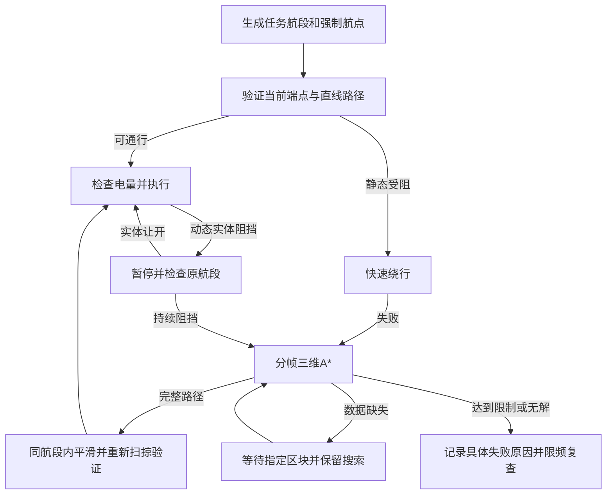

# 货运无人机三维寻路设计

日期：2026-09-28。状态：0.11.0已实现主体并完成隔离回归；原存档／朋友房间验收待更新后进行。以下保留设计目标，实测参数及实现取舍见文末。

本设计针对当前0.10.8的导航模块；实施时取代旧规格中的局部绕行部分。货物事务、所有者权限、供电和调度规则继续遵守原开发规格。以下性能数值是实现和压测的起点，不是已经测得的运行性能。

## 1. 问题与目标

本机日志 `output_log_client__2026-09-28__14-58-27.txt` 显示：15:01:11已经到达入口下点 `(1128.5,76.2,1144.5)`，随后往箱子 `(1144.5,76.2,1162.5)` 飞行。直线分段碰到 `(1130,75,1148)` 的混凝土块，固定候选检查61次后耗尽。召回后重送仍卡在同一处。入口没有丢失，日志也不能证明整个室内不存在可通行路线。

当前 `CargoLocalRoute` 是36种固定折线候选：12种升高、24种左右平移，并非自由三维路径搜索。`CargoMotion` 将16格飞行分段当作局部规划终点；如果分段终点位于墙体内部或需要先远离它再绕回，就可能反复规划失败。

目标：支持入口下降后到箱子的L形、U形、多次转弯及不同高度通道；保留室外高空优先、每次2格升高绕行；所有移动继续通过机身体积碰撞检测。用有限搜索明确区分障碍、数据未加载和预算不足，避免静态场景每秒重复完整重算。

不承诺任意迷宫必达，也不通过缩小机体、忽略墙体、瞬移或远程卸货制造成功。

## 2. 总体结构

采用“任务航段 + 快速绕行 + 有预算的三维A* + 连续碰撞复检”。

强制航点与执行分段分开存储：

| 类型 | 内容 | 是否允许规划替换 |
| --- | --- | --- |
| 任务端点 | 起降点、采集交接点、箱子交接点 | 只允许明确改变任务，或验证同一端点的新交接位置 |
| 强制航点 | 入口上点、入口中心、入口下点 | 按顺序通过；重试和平滑不能跳过 |
| 巡航引导点 | 升空及高空横移引导位置 | 可在同一任务航段内优化 |
| 执行分段 | 为扫掠、区块加载拆出的不超过16格的线段 | 可替换，不要求回到旧分段终点 |

规划终点是下一个强制航点或任务端点，不是直线上的任意16格采样点。新路径完整验证后原子替换当前航段的执行队列；后续强制航点保持不变。

## 3. 三端运输与入口的作用范围

首版维持一个入口绑定收货箱的语义，避免凭高度猜测矿机也需要经过同一个入口。

| 航程 | 默认路线 |
| --- | --- |
| 平台→矿机 | 离开平台→升至巡航高度→接近矿机→交接点 |
| 矿机→箱子，无入口 | 升空→目标附近→交接点；遮挡时搜索接近路线 |
| 矿机→箱子，有入口 | 高空接近→入口上点→入口中心/下点→室内搜索→交接点 |
| 箱子→平台 | 优先反向走实际已通过的轨迹，包含入口退出顺序；不能穿顶板直返 |

入口下点到达后切换为室内策略。入口不负责指定箱子方向，箱子的身份与交接点仍由本批货的目标绑定解析。室内规划终点直接选箱子交接点，允许先远离箱子、绕隔墙后再接近。

入口上下点先验证占用和垂直连接。没有足够净空时报告“入口通道被遮挡”，不把下点改到墙另一侧。入口中心是必经点；直井优先垂直下降。需要转弯的竖井可在相邻强制航点之间搜索，但仍须顺序抵达这些点。

平台或矿机自身也在复杂地下室的情形，首版只在限定局部范围搜索可用出口，不宣称一个“收货入口”覆盖三端所有洞口。超范围或多入口场景后续再提供每端独立入口/中继点，不在本次隐式扩展现有配置语义。

## 4. 室外与室内策略

### 室外

沿用相对两端较高位置加12格的巡航引导；受阻先尝试升高2、4、6……24格，再尝试左右2格递增的折线。均受世界高度和扫掠约束。固定绕行失败进入三维A*，不能因“优先上升”永远排除侧向或下降。

长距离不建立覆盖1000格的体素图。巡航按最多32格前视窗口推进，窗口边界是临时规划边界；若直线窗口终点被占用，可选择已验证、能向下一任务航点推进的窗口出口，不能强制飞进被占用点。进入更大绕行搜索后，必须找到连接到前方可通行走廊的完整局部路线才执行；搜索未完成时不沿“看起来更近”的半截路径盲飞。超出局部窗口能力需明确提示，而非承诺远程全局最优。

### 室内与入口通道

先检查直线；失败直接进入A*，不重复尝试36条通常会穿顶板的高空候选。支持上下和水平连续转向，允许下降绕过横梁。室内没有强制保持高空的惩罚规则。

两个尺度必须区分：室外绕障每次抬高2格的行为保持不变；寻路网格属于内部计算精度，室内用1格，必要时0.5格，不能为了坚持2格采样而漏掉真实通道。

## 5. 三维A*定义

### 图与连接

- 节点是无人机中心位置；常规网格使用确定的世界坐标原点及整数索引，避免浮点作为字典键。
- 室外粗网格2格，室内1格。窄通道细化用0.5格。每一轮图使用单一分辨率；首版不混合不同尺度边，避免复杂接缝遗漏。
- 每个节点最多26个邻居，轴向、平面对角和空间对角均可。每条边用完整机体扫掠验证，不凭目标格为空就放行，禁止从墙角切过去。
- 起点和目标保留原始精确坐标，作为特殊节点连接到相邻网格节点；连接也要扫掠验证。验证距离不超过当前网格体对角线，并检查所有邻近单元顶点，不能仅吸附到最近一个格点。因采样未连通，应细化，不能判实际地形绝对无路。
- 无障碍直连目标时可加入目标连接边，长于16格的检查仍分段，不能绕过完整扫掠。
- 停机坪近距离起降沿用 `CargoDock` 的姿态包围盒，规划和执行使用同一规则；不能在规划中一律把平台当成可穿过的空气。

### 代价与顺序

普通A*，`f=g+h`。`g`为累计几何距离，`h`为到目标的欧氏距离，权重为1。不宣称连续空间全局最短，只在本轮完整已知图内按此代价搜索。

相同f值时使用确定的次序：室外优先上升方向，其次较小h，再使用节点索引；室内优先较小h，最后节点索引。高空偏好主要由巡航层和快速绕行决定，不给A*施加无限上升优先。首版不加入依赖来向的转弯惩罚，避免只以位置为状态却忽略来向导致代价错误；转弯减少由后处理负责。

维护最小堆Open、gScore、parent和扩展标记。发现更小g时更新并允许重新打开节点；使用序号丢弃堆中的旧条目。节点、边、父指针均有硬数量上限。

### 搜索范围与细化

室内先搜索起点/目标包围盒加水平8格、上下4格；未成功时增加至水平16/24格、上下8/16格。硬上限为96×96×64格，并限制在世界有效高度内。目标超出硬上限时直接返回范围限制，不截断目标冒充成功。

扩展顺序：当前1格图→扩大同尺度图→窄通道疑点所在的起终点包围范围用0.5格重新搜索。窄通道疑点由近障碍可通行节点、起终点连接失败等产生，只决定优先尝试细化，不能断言必有通道。细网格也受相同总工作预算；若无法完整覆盖，返回预算/范围限制。

室外按2格→1格，必要时局部0.5格细化。所有轮次累计计算预算，不因扩大范围或换尺度重置预算。只有完整清空Open，且本轮没有未知边时，才可说“此范围、此精度下未找到路线”。

## 6. 碰撞与通道尺度

保持现有飞行包围盒1.6×1.2×1.6格，不按一个点寻路，也不动态缩小无人机。规划使用与执行相同的方块形状、旋转、多方块子块、大型设备模型范围和实体过滤规则。

1格宽的实体竖井不能让1.6格宽无人机通过。2格净宽有几何通过可能，但梯子、门框、半砖和凸出模型会减少净空，仍以实际碰撞盒为准。网格精度提高只能减少采样漏路，不能改变机身尺寸。

示例中中心高度76.2并不意味着能越过顶面76的混凝土：机身下缘约75.6，确实会重叠。抬高、降低或侧绕哪一种可行，必须检查顶棚和通道实况。

路径平滑只在相邻强制航点之间做视线剪枝，每条捷径都重新扫掠。随后按不超过16格分段；运动时继续每不超过100毫秒积分，并在每次移动前检查实际移动片段。局部搜索、平滑、执行三者不能使用不同的碰撞宽高。

交接点继续使用当前原生端点解析结果。若交接点本身被占用，首版明确报告“目标交接位置受阻”；不擅自把无人机放到任意箱子侧面并远程卸货。增加多面交接点属于单独功能，需要重新验证交接距离、视线和库存权限。

## 7. 主线程、区块与计算预算

世界、Unity和原生碰撞数据只在主线程读取。搜索分帧进行，不能将现有 `Sweep` 原样每帧调用几万次，也不启动后台线程直接读世界。

| 项目 | 初始设计上限 |
| --- | --- |
| 所有无人机规划工作总额 | 每帧2毫秒软预算、最多8次新的原生碰撞扫掠 |
| 单个搜索每次调度 | 最多1毫秒、4次新的原生扫掠；轮转公平分配 |
| 同时推进的重搜索 | 最多2个，其余排队；现有飞行和返回安全检查优先 |
| 一次搜索含扩大/细化/平滑 | 最多8192个节点、16384次边验证、100毫秒累计CPU工作 |
| 搜索缓存 | 单航班目标不超过8 MiB，全局不超过32 MiB；超限释放可重建缓存或停止搜索 |
| 单架/全局区块预算 | 沿用49/128，不因A*扩大 |
| 没有货时轮询 | 保持5秒 |

上述毫秒是协作式软预算：一次原生调用不可中断，须记录最大单次耗时及超预算帧；预算检查在调用前后执行。节点数、边数和内存是硬上限。不能承诺严格每帧零尖峰。

引入航班规划上下文，加载当前探测需要的区块及现有大型模型检查边界。共享同一航班的租约和预算；不为每个A*节点创建观察器，不一次加载整个搜索立方体。

静态碰撞数据按区块建立有界快照/查询缓存，主线程渐进构建。缓存带世界代次和区块变更标记，放置、拆除、门状态或端点变更使相关缓存失效；若无法可靠捕获某种变更，最长1秒重新验证相关缓存。实体数据不作为永久静态墙缓存。所有最终路径仍做实时复检。

未知边进入等待集合，不计为障碍。每搜索最多4条待数据边，达到后暂停发新请求；就绪边可继续搜索，未知节点不会加入永久Closed。区块准备完毕后恢复原边，不从起点重算。全部等待时状态为加载等待；区块名额不足时为名额等待；CPU让出时为规划中，三者分开。

不同探测块在内存中保留快照而非长时间占住所有租约；优先保留当前机体/近期执行航段。预算申请不成功则撤回未完成的规划申请、轮转让出，避免多架各持部分名额互锁。提交路线前重新申请实际执行窗口。连续加载30秒无进展只提示超时并保留安全悬停，不伪造无路。

## 8. 动态阻挡、重试和状态

静态障碍用于主路径图；动态实体单独分类。候选完整静态路线遇到实体时先保留路线等待。每1秒重新检查被挡片段，实体让开即继续；持续3秒受阻时，可在同一范围内尝试以当前实体位置为临时障碍的替代路线。实体仍参与执行碰撞，不能为了找路穿过随身无人机。玩家过滤规则保持当前行为。

普通“失败路线检查”仍为每1秒一次，但只是检查当前障碍和缓存有效性，不每秒无条件跑完一轮A*。静态场景没有变化时，完整重搜索最短间隔5秒；相关地形改变或用户手动重试可提前进入队列。搜索正在进行时一秒检查不会取消它。电量、货物和强制航点均不能被重试重置。

建议扩展 `NavigationStatus`，保留运输Phase独立显示：

| 状态 | 界面含义 |
| --- | --- |
| Planning / Queued | 正在规划三维路线／等待规划名额 |
| WaitingData / WaitingBudget | 等待指定区域数据／区块名额 |
| DynamicBlocked | 通道被实体占用，等待让行 |
| GoalBlocked | 目标交接点或入口点净空不足 |
| NoPathInBounds | 已检查范围与精度内未找到路线 |
| SearchBudgetExceeded | 搜索达到计算或范围限制，不能断言无路 |
| RouteInvalidated | 环境改变，当前航段重新规划 |
| Ready / Moving | 路线已验证／正在飞行 |

同一重试循环不能把短暂区块申请覆盖为唯一长期状态：面板显示主要阻挡原因，次行显示当前探测是否等待数据。

## 9. 电量与返航

沿用已实现的整趟预算、入口室内余量和30%安全电量。搜索等待按当前规则不扣移动电量，不能趁等待恢复电量。

获得完整室内路线后，以实际路长和低速接近段重新核对：剩余去程 + 装卸 + 该路线反向退出 + 已记录返航走廊 + 剩余绕行余量 + 安全储备。预算不足立即进入已有返航流程；每次实际移动前的能量检查继续有效。

返回优先实际走过的轨迹。轨迹因新增障碍被挡时先等待；必要的局部A*只能接回有序的后续返航锚点，不能跨越未退出的入口强制点。连接失败保持悬停；连接成功还要验证新连接与剩余返航的电量。实际执行的新连接逐段记录，不能把未飞过的计划路径当成安全返航历史。

低电量返航后充满再重试的规则保留。仅因静态无路而召回的任务保存失败位置/环境版本，重送前先检查失败是否已解除，避免无限“平台—入口—平台”无效循环。

## 10. 持久化、取消与兼容

新增版本化导航状态：航段类型、强制点序列及索引、入口配置快照、当前执行队列、最后失败原因、规划代次。配置入口和本批货入口分别保留，不能重开游戏后混用新旧货目标。

不持久化Open/Closed、区块租约或实体快照。恢复时从当前位置继续当前强制点约束下的规划，并重新检查世界；货物、事务编号、库存版本、电量及实飞轨迹使用原持久化机制。

更换目标、更新入口、召回、平台销毁、离线或世界暂停必须使旧搜索结果无法提交。每份结果绑定世界/航班/路线版本/强制点索引/起点；提交时逐项匹配。暂停或离线可以丢弃搜索缓存释放租约，但不能丢弃任务路线。

旧版16格队列缺少强制点类型，迁移需结合本批货入口、运输阶段、坐标和现有实飞轨迹重建；不能盲目把所有旧分段都提升为强制点。无法可靠判断入口是否已穿过时安全暂停并提示重新选择入口或召回，不凭高度猜测穿墙恢复。0.10.6针对入口正上方丢失下降点的已验证修复可以保留。

## 11. 日志与实现拆分

新增 `search-start / search-stage / search-wait / search-finished / route-invalidated`。记录：航班和规划代次、航段类型、当前强制点、起终点、搜索范围、网格精度、扩展节点/边数、Open与待数据数量、累计CPU、墙钟等待、峰值区块、缓存命中率、失败分类、动态实体编号、返回路长及电量判断。进度摘要最多每5秒一条，结果和路线切换立即记录，不逐节点刷日志。

建议模块：

1. `CargoNavigationPlan`：区分强制点与执行分段，维护路线版本和阶段。
2. `CargoPathSearch`：不依赖Unity的A*、确定性优先队列、边查询状态和预算。
3. `CargoNavigationScheduler`：房主端全局时间/节点/区块公平调度。
4. `CargoNavigationCollision`：可追溯的静态/实体碰撞查询、区块快照和失效。
5. `CargoMotion`：执行提交后的路线、逐片段验证、恢复和实际返航记录。

先完成强制点与执行分段分离，再接入室内A*和预算，最后迁移旧存档及增加UI诊断。外部状态枚举、网络包与检查点格式新增字段需统一版本，房主和客户端同步更新；不在实现前提前提升当前Mod版本。

## 12. 验收门槛

| 场景 | 必须验证的结果 |
| --- | --- |
| 本次入口到箱子 | 使用实测坐标和复原几何；入口到达后能绕障，或准确报告通道/预算限制 |
| L形、U形、多隔墙 | 允许先远离目标并多次转弯，最终抵达真实交接点 |
| 16格采样点落入墙内 | 替换执行分段，不能强制返回墙内采样点 |
| 顶板、横梁和上下错层 | 不穿顶；可按实况下降或侧绕，不无限抬高 |
| 2格井、1格井、梯子门框 | 实际净空够才通过；1格井不因细化网格而穿模 |
| 起点/箱子非整格高度 | 精确端点连接正常；无连接时细化或明确报告 |
| 动态随身无人机堵入口 | 一秒复查；让开即续飞，入口顺序不丢失 |
| 箱子上方被实体方块占用 | GoalBlocked；不在远处卸货 |
| 无路与未加载 | 未知数据不当墙，预算耗尽不宣称绝对无路 |
| 召回/换目标/离线发生在搜索中 | 旧结果不提交、任务不串线、不修改库存 |
| 返回路径新增障碍 | 不穿墙直返，不跳过入口，额外绕行仍满足能量约束 |
| 完整存档重开 | 任务、入口顺序、货物与电量一致，重新验证路径 |
| 全服4架同时受阻 | 满足总调度预算、无饿死/互锁、缓存上限和租约释放正常 |
| 实际朋友房间 | 双方同步版本，日志与肉眼轨迹一致，无需手动召回才能推进 |

核心测试使用碰撞几何和可控未知数据，验证路径所有边、入口顺序、有限停止和物资守恒；原生测试复原带顶地下室和实体堵塞，测量真实扫描耗时。节点及时间上限必须先压测，再决定是否调整，不能为了单个样例通过取消上限。

当前日志只包含命中的部分方块，不是完整地下室模型。实施验收需要从本机测试存档提取对应区域的只读几何快照，或构建明确标注为近似的测试房间；仅复现一个命中方块不能声称通过原存档验收。

## 13. 0.11.0 实现记录

- `CargoDroneMotion` 保存有类型的任务／入口／返航锚点，分段和A*结果是可替换执行队列。室内直接到下一强制点规划，室外最多32格前视，快速升高绕行优先。
- `CargoDronePathSearch` 为不依赖Unity的26邻接3D A*，支持1格／0.5格室内搜索、精确端点、完整扫掠、分帧推进、分段平滑及有界失败。未知数据保留当前边，首版采取单边等待（未实现4条待数据边并行推进），避免同时摇摆申请多个区块。
- 原生游戏中初始100毫秒仅完成约149节点／905次查询，不足以处理测试隔墙；原生总预算改1500毫秒，纯几何保留100毫秒。相同原生房间成功搜索294节点、2615次查询，约285毫秒。每帧时间为软上限；节点、查询、窗口与区块上限仍为硬约束。
- 调度器公平推进最多2个搜索；结束或取消即时注销。离线／暂停丢弃搜索，保留任务路线；搜索与执行均在主线程，不存在后台过期结果提交。
- 新检查点扩展记录锚点类型、代次、状态和最后失败航段；不存储Open/Closed。旧的共线16格分段合并；入口进度模糊则暂停。恢复查询仍须重新检查碰撞。
- 受阻带货返航后的重送以失败航段重新搜索为门槛，没有依赖不可靠的全世界几何版本号；失败至少间隔5秒。真正飞回所用连接逐段碰撞复检，实际位置和待执行返航锚点随原检查点保存；历史出航轨迹保留，返航已走过的额外连接由分段日志记录。
- 现有库存事务、身份验证、供电、机身体积、30%返航储备及空货源5秒轮询保持。
- 验证证据：`Test-CargoDroneCore.ps1`、`Test-CargoDroneNavigationScheduler.ps1` 与隔离原生 `CargoDroneNativeQA`。测试含U形先远离目标、下绕横梁、2格和1格净空、精确端点、未知数据、预算限制、16格端点在墙内、规划中存档／召回、失败航段重送检查。四任务调度公平性为离线时钟测试，不等同于四客户端联机验收。
- 原生房间是明确构造的近似几何，未取得用户原存档完整体素快照，不能宣称用户原房间已经验收通过。客户端按E交互沿用现有实现，此次不将其列为新增实机验收成果。
