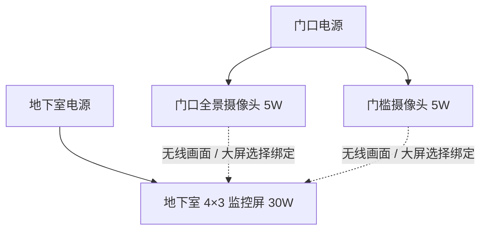

# 地下室基地监控系统：4×3 格大屏实施方案

版本：1.2　日期：2026-09-25　状态：首版代码、XML、DLL、离线检查和原生启动检查已完成；仍需玩家客户端画面验收。

用户明确需求：地下室安装大屏和门口摄像头，在地下室观察基地门口动态；大屏为宽4格、高3格；摄像头与大屏之间不用线路绑定，在大屏上直接选择摄像头。用户已确认“无线连接，监控基地周边即可”。视频连接采用无线配对，两端分别供电，本版选择128格作为绑定范围的开发默认值。以下其余数值为本方案选定的开发默认值，可以通过实机测量调整。文中的新模块、物品、命令及脚本名称均为计划名称。

## 1. 交付目标与首版范围

玩家站在地下室里，直接看墙上实体屏幕，就能看到门口的僵尸、玩家、开关门和车辆移动。人物继续留在原位，可自由走动；正常观看不打开全屏界面。

首版交付两种可制作设备：基地监控摄像头、4×3基地监控屏。每块屏幕最多保存4个镜头，单画面显示，支持手动切换和每5秒轮巡。一个镜头可以被多块屏幕绑定。四分屏、夜视、录像回放、远程转动镜头和门禁联动列为后续扩展，不作为首版的依赖。

首版支持单机、房主联机和安装相同模组的专用服务器客户端。服务器负责设备状态与配置；实时图像由各观看客户端根据本机已经加载的场景生成。专用服务器不生成视频帧。

核心验收场景：摄像头位于地面门口，地下室地板比地面低16～32格，屏幕与摄像头水平相距16～48格。玩家不离开地下室，门口目标移动应在屏幕上连续可见。此场景必须用有图形的真实客户端验证，不能用编译通过或服务器日志代替。

## 2. 实际安装与操作

推荐第一次安装使用一块屏幕、两个摄像头：

| 设备 | 建议位置 | 用途 |
| --- | --- | --- |
| 门口全景摄像头 | 门外侧墙或立柱，离地3～4格，斜对门前道路 | 看接近基地的目标 |
| 门槛摄像头 | 大门另一侧，离地3格，朝门框外沿和围墙脚 | 补充门框盲区，确认堵门目标 |
| 4×3屏幕 | 地下室留出完整4×3墙面；推荐屏幕下沿离地1格 | 站在约4～8格处观看 |
| 电源与继电器 | 摄像头就近取电，大屏接地下室电网 | 两端可用不同电源，不要求电路互通 |



两台摄像头加一块屏幕的设计额定耗电为40W，不含继电器和照明等其他负载。摄像头和屏幕之间没有视频线或专用信号端口，任意有效电源均可分别供电；不要求同一发电机、电池组或继电器网络。若玩家选择共用电源，仍应分别分支供电，大屏不要串接到运动传感器的触发输出端，否则可能只有检测到目标时才得到电。

操作流程：

1. 工作台制作设备，在门口放置摄像头并接电。
2. 在摄像头旁使用原生镜头预览调整朝向，确认画面覆盖门前道路；设置名称，例如“正门外侧”。首版在摄像头本地调角度。
3. 地下室放置大屏，接到地下室电源。长按交互进入“监控设置”。
4. 选择1～4号频道；大屏自动列出已登记、可绑定设备，显示坐标标签、距离和供电状态。点击“绑定到频道”即可，无需先在摄像头执行配对、使用接线工具或输入坐标。绑定上限为屏幕到摄像头三维距离128格，列表最多32项。
5. 确认绑定后退出菜单，屏幕显示选中镜头。频道选择和5秒轮巡均在“设置监控”菜单完成；通断与回收沿用原生供电方块操作。
6. 摄像头拆除重放后必须重新绑定；旧位置放置另一台设备不会自动接管旧频道。

128格是绑定校验上限，不是保证能出画面的范围。若镜头未出现在列表，应先检查摄像头是否已放置、属于本模组、加载及权限状态。

### 2.1 大屏无线绑定菜单

```text
监控设置                         频道 1 / 2 / 3 / 4
当前频道：1    当前镜头：未绑定

添加摄像头
坐标标签                 距离       状态
摄像头 120,45,-30        36格       有电
摄像头 113,44,-18        29格       有电
摄像头 89,47,-42         57格       无电

[绑定到频道]  [清除此频道]  [开启/关闭轮巡]
```

摄像头默认以坐标标签和距离区分。选择后在大屏确认绑定，绑定结果保存到存档。已经放置、已加载但无电的摄像头也可绑定；屏幕显示“摄像头无电”，供电恢复后自动播放。设备本地调角用于取景，不是配对前置操作。

墙壁、楼板、地下深度不产生模拟无线信号衰减，不需要额外天线、中继器、Wi-Fi路由器或配对工具。电网变化只影响供电状态，不改变设备身份和绑定；断电恢复后不用重新配对。摄像头拆除重放仍按新实例处理。

技术上由服务端提供范围内已加载设备的有界候选列表，点击绑定时重新核验实例及权限，避免列表刷新后设备已被替换。查找、绑定和播放逻辑不得把两端是否相连、是否共用电网作为条件。无线配对的范围与第5.3节的客户端场景就绪条件分别校验。

## 3. 大屏与摄像头规格

### 3.1 4×3实体大屏

| 项目 | 首版规格 |
| --- | --- |
| 方块名称 | `PZAEC_SurveillanceScreen4x3`，中文“4×3基地监控屏” |
| 占格 | `MultiBlockDim=4,3,1`，宽4、高3、逻辑厚度1格，共12格 |
| 物理外观 | 外框约3.96×2.96格，厚约0.18格，深灰金属窄边框 |
| 显示区域 | 约3.68×2.76格，保持4:3；所有机位渲染比例也是4:3 |
| 安装 | 竖直壁挂，四个水平方向旋转；放置预览覆盖完整12格 |
| 供电 | 原生接线，30W；下边框靠近主格处设置可辨认的接线端子 |
| 交互 | 点中任一子格解析回主格，供电、绑定、回收只操作一个设备 |
| 耐久 | 建议1000，击毁整体移除，回收只得到1个屏幕 |
| 画面 | 自发光/无光照视频材质，黑暗中可读；不额外制造房间照明 |

画面顶部以小字显示频道与名称，底部显示状态；文字不覆盖中央观察区域。通电待绑定显示“请选择摄像头”；屏幕断电时黑屏，只在玩家瞄准后的交互提示里显示断电原因。

采用独立运行时模型：外框、背板、屏面和主碰撞体由C#生成，参考现有地下室灯的模型注入与生命周期处理。供电可参考`BlockPoweredLight`/`TileEntityPoweredBlock`，屏幕模型不创建原生灯光。先验证供电基类和多格块的组合，再定最终继承结构。

主格原点、旋转后的偏移和模型碰撞体以原生多格块规则为准，开发时制作四方向坐标夹具；不凭视觉位置猜主格。碰撞体限定在自身逻辑占格范围内，放置到已有物体上应失败。屏幕顶部比地面高4格时，房间需要留出相应空间。

### 3.2 摄像头

| 项目 | 首版规格 |
| --- | --- |
| 方块名称 | `PZAEC_SurveillanceCamera`，中文“基地监控摄像头” |
| 原生基础 | 从`motionsensor`派生，保留运动传感器模型、镜头支架及角度调节 |
| 占格 / 供电 | 1×1×1逻辑占格，5W |
| 镜头位置 | 使用`IPowerSystemCamera.GetCameraTransform()`返回的镜头节点 |
| 朝向 | 使用原生Yaw/Pitch存档与同步；本地预览设定 |
| 画面视角 | 预设垂直FOV 60°，4:3画面；以实机覆盖门前道路为准 |
| 裁剪 | 初始near=0.05格、far=80格；确认镜头不在模型或墙内 |
| 耐久 | 建议300，允许原生规则下修理与回收 |

实时画面读取摄像头“实际供电”状态，不能把`IsTriggered`当作画面开关。原生调角预览与最终画面需要对齐FOV和比例，或者在原生预览里标出最终4:3取景框；只对新摄像头生效。

首版不承诺夜视。夜间图像遵循门口真实照明；建议安装门灯。可保留原生传感器触发输出，玩家可自行接警灯，但不将“检测到目标”当作系统已识别出僵尸种类。

### 3.3 制作默认值

| 设备 | 工作台配方草案 | 时间 |
| --- | --- | --- |
| 摄像头 | 锻铁8、电气零件10、机械零件4、碎玻璃4 | 30秒 |
| 4×3屏幕 | 锻铁30、电气零件30、废聚合物40、碎玻璃30 | 90秒 |

以上是平衡默认值。首版在工作台直接可制作，避免引入未验证的技能解锁链；发布前用最终合并配置核对材料名称与配方。

## 4. 已验证的技术基础与待验证项

本轮已读取本机XML、模组源码，并通过Mono.Cecil检查安装游戏的程序集和部分IL。实现后已用隔离UserData启动真实专用服务器，验证DLL初始化、XML合并、4×3多格坐标、供电TileEntity类型和存档注册器挂接。专用服务器没有图形设备，因此实时屏面仍需玩家客户端验证。

程序集：`../7DaysToDie_Data/Managed/Assembly-CSharp.dll`。

- MVID：`229796d0-95ca-4662-b426-1a6f1f1596ed`
- SHA256：`CB33A4ADBD9BD25C98255B8DE675B3050EA39C782A515EC97CF943EAC4A480FE`

| 本地证据 | 已核对事实 | 开发用途 |
| --- | --- | --- |
| `../Data/Config/blocks.xml`中的`motionsensor` | `Class=MotionSensor`、5W、运动传感器模型、Yaw/Pitch配置 | 摄像头基础设备 |
| `MotionSensorController` | 实现`IPowerSystemCamera`；`GetCameraTransform()`实际返回`Cone`节点 | 沿用原生镜头位置与旋转 |
| `XUiC_CameraWindow.CreateCamera()` IL | 实例化`Prefabs/ElectricityCamera`，挂到镜头节点，设置`targetTexture` | 独立监控渲染器的参考路径 |
| `XUiC_CameraWindow` | 持有`UnityEngine.Camera`和`RenderTexture` | 原生已有实时画面基础 |
| `TileEntityPowered`及派生类 | 有`IsPowered`、角度数据；触发器另外有`IsTriggered` | 区分供电、开关和触发 |
| `../Data/Config/blocks.xml`多格电视及其他块 | 原生支持`MultiBlockDim` | 4×3整体占格 |
| `ZZZ-PZAEC_BasementLight/Source/BasementLight.cs` | 运行时模型、原生供电、接线锚点、材质回收处理 | 大屏外壳及生命周期参考 |
| `97-AutomationWorkshop/Source/CargoDroneNative.cs` | 使用`ChunkCustomData`保存设备实例信息 | 设备身份和绑定持久化参考 |
| `97-AutomationWorkshop/Source/CargoDroneNativeLeases.cs` | 明确区分服务器数据加载与光照、网格就绪 | 不能拿服务器区块加载证明客户端能看见场景 |

最关键的未知项是地下室与室外镜头同时存在时的地形网格、动态实体、遮挡剔除、天气和光照表现。原生预览能创建相机，不等于远处墙面显示已经通过测试。

可复查接口的现有工具是`tools/Inspect-CargoDroneApi.ps1`，使用PowerShell 7。示例在PowerShell 7中执行：

```powershell
& ./tools/Inspect-CargoDroneApi.ps1 -GameRoot '..' `
  -TypeName @('XUiC_CameraWindow','MotionSensorController','TileEntityPowered') `
  -MethodPattern 'CreateCamera|GetCameraTransform|IsPowered' -IncludeIL
```

## 5. 运行时实现合同

### 5.1 实时画面管线

`摄像头原生镜头节点 → 独立ElectricityCamera实例 → RenderTexture → 墙上屏幕材质`。

新建独立`SurveillanceRenderService`管理相机和纹理，不通过反复打开原生XUi窗口维持视频，也不占用原生预览窗口的纹理。优先实例化已确认存在的`Prefabs/ElectricityCamera`，参考原生设置，核查附带组件，只保留需要的渲染组件。不能复制玩家整套相机、音频监听器和输入组件。

每个渲染相机跟随真实镜头节点，Unity对象必须在主线程创建和销毁。浮动原点变化时优先依靠父节点同步；摄像头区块重新生成模型后重新获取节点，禁止长期保留失效Transform或把绝对世界坐标直接当渲染坐标。

关闭相机自动每帧渲染，统一调度`Camera.Render()`。原生mask为基础，明确排除玩家第一人称手臂、HUD、交互辅助物和监控屏的动态画面表面。保留僵尸、其他玩家、车辆、门和地形。只渲染到纹理，不改变玩家主相机位置和控制状态。

监控屏相互拍摄时必须阻断反馈：优先使用确认可用的渲染层隔离屏面；若没有独立层，则仅在本次手动渲染作用域隐藏本模组屏面，并在`finally`中恢复。不能全局改掉其他方块的层。此路径需要“摄像头对着另一块屏幕”验收。

材质采用游戏实际可用的无光照纹理shader，首阶段核对支持情况、图像上下方向、色彩空间和亮度。每块屏幕使用独立材质实例；同一镜头的纹理按引用计数共享。不要对原生共享材质直接设置画面纹理。

### 5.2 激活条件与性能预算

| 设置 | 默认值 / 行为 |
| --- | --- |
| 标准画质 | 768×576，10帧/秒，MSAA关闭 |
| 激活距离 | 玩家到屏幕主格距离≤10格；离开后立即显示待机并停止请求画面 |
| 可见性 | 用本地玩家主相机判断正面与视锥；不能用所有相机都会影响的`Renderer.isVisible`单独判断 |
| 独立视频流上限 | 每客户端同时2路；同镜头多块屏幕共用一路 |
| 调度 | 一帧最多执行一次额外相机渲染，轮询公平调度，不补跑错过的帧 |
| 不观看时 | 立即停止渲染；5秒后释放无引用相机和纹理 |
| 状态检查 | 活跃订阅最多每0.5秒一次；服务端变化推送配合2秒心跳 |

多屏超过预算时，优先当前正在交互和画面中央较近的屏幕，其余显示“待机：观看名额已满”。首版每块屏幕只请求选中频道，不为4个绑定镜头同时渲染。轮巡采用本地计时并跳过明确失效频道；服务端同步的是频道顺序与轮巡设置，不持续广播每次轮巡切换。

每路768×576 RGBA8纹理约1.69MiB颜色数据，另有深度和渲染器临时资源，不能以颜色纹理大小代表完整显存开销。场景二次渲染是主要成本。性能验收目标为标准单路监控启用后平均帧时间增加≤15%；这是待测目标，不是已测结论。未达到时先检查阴影与后处理开销，再调整默认画质。记录CPU/GPU帧时间；仅测`Camera.Render()`调用耗时不能替代GPU测量。

### 5.3 场景加载与真实性

首版围绕同一基地的近距离监控，不额外强制加载地图区域。必须分别判断服务端设备存在、客户端摄像头模型就绪、监视方向所需场景网格和动态实体可用；“服务器有区块数据”不足以进入正常播放状态。

根据裁剪距离及视锥计算涉及的客户端区块，核查游戏可提供的网格就绪状态。具体API在第一阶段确认；不能只检查镜头脚下一个区块。动态实体可见性必须通过地下室测试确认，不能用空景或静态方块截图代替。

若缺区块，显示“监控区域未加载”；加载中显示“正在连接画面”。已有画面因加载失效或更新中断超过1秒时撤下最后一帧，显示状态卡，避免冻结画面被误认为门口安全。不做穿墙显示，也不显示未同步到客户端的敌人位置。

若近距离地下室场景仍因主相机剔除而漏掉地面或僵尸，必须先解决客户端可见性问题，再继续功能开发。若需要额外客户端观察点才能满足核心场景，形成有区块预算、实体同步和释放规则的补充设计，并实测；不能直接把货运无人机的服务端ChunkObserver照搬过来宣称问题已解决。

### 5.4 显示状态

| 状态 | 屏幕行为 |
| --- | --- |
| 大屏断电 / 手动关闭 | 黑屏；交互提示显示原因 |
| 未绑定 | 显示“请选择摄像头” |
| 摄像头断电 | 显示“摄像头无电”，保留频道名称 |
| 摄像头确定已拆除或实例被替换 | 显示“摄像头已移除，请重新绑定” |
| 摄像头或目标区域未加载 | 显示“监控区域未加载”；不据此删除绑定 |
| 客户端同步超时 | 显示“连接中断”；停止显示旧画面 |
| 正常播放 | 显示频道、名称和实时图像 |
| 预算不足 | 显示“待机：观看名额已满” |

远处设备无法读取时只能报告未知或未加载；不能猜测设备已经被拆。摄像头实际断电等变化在网络正常情况下目标为2秒内反映到大屏。

## 6. 存档、联机与生命周期

设备仅由服务端创建持久身份。当前实现使用世界存档目录内带版本的`pzaec-surveillance.xml`，保存前先写临时文件，再替换主文件并保留`.bak`。摄像头记录GUID、类型、坐标标签和放置者；屏幕记录自己的身份、配置修订号、4个绑定GUID、选中频道及轮巡设置。绑定引用实例GUID，摄像头拆除重建后不会错误串台。存档无法解析时，本会话禁用写入，保留原始文件供恢复。

默认允许附近玩家观看实体屏幕；首版配置权限归放置者，管理员按服务器规则处理。客户端发起设置时，服务端从真实Sender识别玩家，核查距离屏幕≤6格、主格及实例匹配、配置权限、设备类型、128格距离、频道上限和修订号。原生摄像头角度调整继续走原生权限路径。可在后续配置增加共享管理。

两人同时修改时采用配置修订号：旧修订请求返回“配置已更新，请刷新”，不覆盖较新的配置。频道固定4个；列表显示上限32项；每玩家请求限速。绑定目标由服务端重新核实类型、GUID、权限、操作距离和128格范围。

只同步身份、绑定、供电和显示配置，不发送逐帧图片。服务端每2秒扫描已加载设备并广播有界快照；观看客户端只在玩家靠近屏幕时创建本地视频流。流停止使用5秒后释放相机和纹理。设备区块不具备读取条件时显示未加载。

数据格式设版本和长度上限，保存时调用区块修改标记并沿用现有区块序列化同步约束。格式错误显示配置错误且保留可排查的数据，不静默覆盖。原生方块、电网和自定义元数据并非跨区块原子事务，读档后需逐项核对；不能把“内存写成功”描述成崩溃后必然保存。测试覆盖正常保存重启和设备替换后的保守恢复。

OnDisable、区块卸载、设备破坏、退出世界、断线均需撤销订阅和释放引用。最后一位观看者离开后释放相机与RenderTexture；销毁屏幕时不破坏其他屏幕共用的纹理。处理原生对象池回收时参考现有地下室灯对sharedMaterials的保护，但视频资源应有独立所有权。模型预览或背包预览不创建实时监控相机。

服务器和客户端都安装同一版本模组；无图形服务器路径不得创建Camera、RenderTexture或屏幕材质。发布前新增ModInfo版本与DLL一致，并核对加载日志。

## 7. 代码与文件划分

独立模组目录建议为`ZZZ-PZAEC_Surveillance/`，依赖现有`0_TFP_Harmony`和游戏程序集。只针对新方块生效，不作为RuntimeFix内的零散补丁。

| 文件 / 模块 | 职责 |
| --- | --- |
| `ModInfo.xml`、`Config/blocks.xml`、`recipes.xml`、`Localization.csv` | 两种设备、中文说明、配方、多格和供电配置 |
| `SurveillanceMenu.cs` | 运行时频道选择、无线设备列表、供电状态、绑定和轮巡菜单 |
| `Source/PZAEC.Surveillance.csproj` | net48、输出到模组根目录、游戏引用Private=False |
| `ModApi.cs` | 初始化与仅针对新设备的Harmony挂接 |
| `ModApi.cs`、`ScreenModel.cs` | 多格主格解析、模型、碰撞、接线、交互和原生镜头适配 |
| `SurveillanceState.cs` | GUID身份、绑定、配置修订号、世界存档和恢复校验 |
| `SurveillanceProtocol.cs`、`SurveillanceMenu.cs` | 服务端验证、限速、配置请求回复、设备列表和频道菜单 |
| `SurveillanceRenderService.cs` | 客户端流共享、画面调度、加载就绪、失效状态和资源释放 |
| `PZAEC.Surveillance.dll`、`README.md` | 编译输出与玩家安装使用说明 |
| `tools/Surveillance/` | 编译、契约检查、实机QA场景和验收结果 |

默认编译脚本拟定为`tools/Surveillance/Build.ps1`，支持输出到`.local-tests/Surveillance/`。遵守仓库使用PowerShell 7、原地引用游戏Mono程序集的构建方式。实现提交时源码、ModInfo版本和DLL必须一起交付。

## 8. 按关卡执行的开发顺序

| 阶段 | 执行内容 | 必须得到的证据 | 失败后的动作 |
| --- | --- | --- | --- |
| G0：原生接口整理 | 固定程序集版本，确认镜头Prefab、供电、多格、元数据与XUi挂接 | 可编译的最小适配层；接口审计记录 | 按本机签名调整；不猜API |
| G1：地下室视频原型 | 门口放一个派生运动传感器，地下室临时4:3屏面显示它的RenderTexture | 有图形客户端里拍到门外僵尸和门的连续移动；记录场景、画质和帧时间 | 排查客户端网格、实体剔除、shader和镜头节点；未通过前不宣称可用 |
| G2：4×3实体设备 | 加入正式模型、12格占位、四方向放置、供电和交互 | 四方向放置/碰撞/拆除正常；不侵入邻块；断电黑屏且恢复自动播放 | 修正多格原点与电力基类适配 |
| G3：完整配置和存档 | 大屏无线设备列表、点击绑定、4频道、名称、切换、轮巡、设备身份和生命周期 | 独立电网之间可直接选中配对；保存重启后恢复；破坏重建不串台；切世界不泄漏 | 修正设备发现、身份和恢复校验 |
| G4：联机 | 增加请求验证、状态订阅、两客户端独立渲染 | 远端玩家也能观看，供电和设置一致；服务器不生成图像 | 处理同步/权限/区块差异；不以房主成功替代远端成功 |
| G5：性能与发布 | 完成低画质、调度、资源回收、完整模组集兼容检查 | 帧时间对比、资源回收记录、无持续报错、发布说明 | 定位瓶颈并调整默认值，保留实测记录 |

G1是可行性决定点，交付证据必须包括地下室场景。屏幕有静态图片、只打开全屏摄像头窗口、服务器日志正常都不满足G1。G1～G5全部通过后，才能把此方案标记为已实现。

## 9. 验收清单

| 编号 | 场景 | 通过条件 |
| --- | --- | --- |
| A01 | 地下16和32格，门口水平距离16和48格 | 玩家不出地下室，屏幕能持续显示目标移动、开关门；墙体不会造成画面缺地形 |
| A02 | 画面面对门、背对玩家主视线；门遮挡僵尸 | 镜头朝向正确；门能遮挡目标，无透视；开启原版遮挡剔除仍可用 |
| A03 | 四方向放置4×3屏、跨区块边界放置、旁边已有方块 | 12格真实占位、预览准确、不覆盖其他方块；各子格均能交互 |
| A04 | 打碎/回收主格和任意子格 | 整体移除，只有一份回收物，电线和绑定清理，无残留碰撞 |
| A05 | 分别关摄像头、大屏电源，再恢复 | 状态正确；摄像头无人经过仍有画面；恢复供电自动恢复 |
| A06 | 保存退出、读档；摄像头在原坐标拆除重建 | 正常绑定保留，新实例不会继承旧频道 |
| A07 | 日间、夜间、雨雾，地下室明暗变化 | 室外画面色彩可读，受室外环境影响；不会错误套用地下室黑暗或玩家屏幕特效 |
| A08 | 摄像头区域卸载、网络中断、重新加载 | 明确状态卡，旧图不冒充实时画面；重连后自动恢复 |
| A09 | 两块屏看同一镜头、三个独立镜头竞争、两个玩家观看 | 同客户端共享纹理且遵守2路上限；不同客户端独立；无互相抢占原生预览 |
| A10 | 镜头对屏幕、浮动原点变化、退出世界重进 | 无递归画面、镜头漂移、异常音频监听器或资源残留 |
| A11 | 房主联机及专用服务器上的远端客户端 | 能看到同一门口实时变化；频道配置与供电一致；无图形服务端不创建图形资源 |
| A12 | 双人同时改配置、远距离伪造请求、过长名称 | 修订冲突明确，非法请求被拒绝；不会修改其他设备 |
| A13 | 标准单路开启/关闭对比 | 同场景预热后各记录60秒帧时间，平均开销目标≤15%；记录p95、渲染速率和显存表现 |
| A14 | 重复开启关闭及卸载设备20次 | 相机/纹理数量稳定，无单调增长；最后关闭后资源按5秒回收规则释放 |
| A15 | 摄像头与大屏用两套独立电源，中间隔墙和地下楼板 | 只在大屏列表点选即可绑定并播放，无信号线、同电网或视线连通要求 |
| A16 | 在列表绑定无电摄像头；之后通电、改接另一电源 | 可保存绑定并显示无电状态，通电自动播放；改接电源不会丢失绑定 |

离线测试重点验证身份替换、修订冲突、状态转换、四方向占格计算和调度公平性，不编写仅复述常量的测试。XML解析检查与编译后，还需检查游戏合并配置、实际接线和加载版本。

原生QA使用`.local-tests/Surveillance/`的独立UserData与模组副本，先检查是否已有QA游戏进程，保持一次只运行一个。图形测试不默认使用`-Headless`或`-nographics`。专用服务器验证数据和电力，真实图形客户端验证屏幕、实体、光照与性能。

## 10. 当前交付状态

已完成：独立模组目录、两种可制作设备、4×3真实占格、独立供电、128格无线选择、4频道与5秒轮巡、服务器权限和修订校验、世界存档、客户端共享视频流、每客户端两路上限、无图形服务器旁路、构建脚本、离线契约检查及原生服务器启动检查。运行时已核对多格子坐标为`x=-2..1、y=0..2`，模型按该中心对齐。

尚待玩家客户端实测的项目：门口动态画面、四方向实际观感、跨区块场景完整性、中文TextMesh字形、两名远端客户端以及帧时间。它们需要进入有图形的游戏客户端放置设备，不能由专用服务器日志替代。执行顺序按A01、A03、A05、A09、A11、A13进行，发现画面或方向问题后再调整发布版本。
